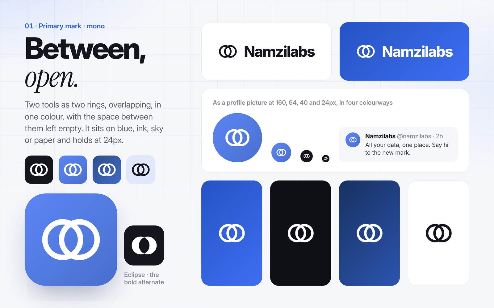
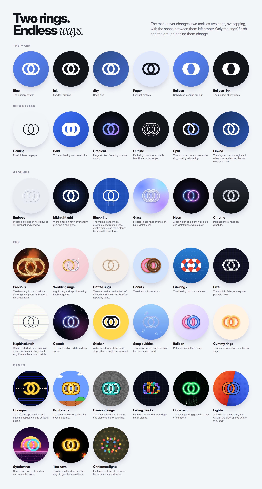
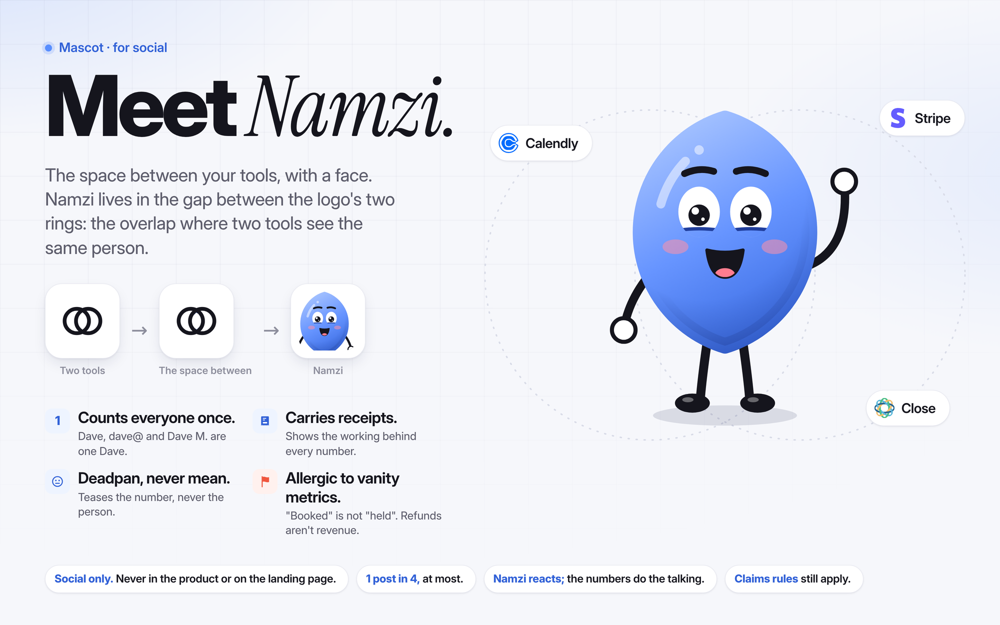

# Namzilabs brand kit — for content

Everything a post or video needs so the brand reads as one brand. The source of truth in code is [`lib/brand.css`](../lib/brand.css).

## Logo

**The mark: 01 · Between, mono** ([board](logos/boards/01-between-mono.png)). Two tools as two rings, overlapping, in one colour, with the space between them left empty. Whatever sits behind the mark shows through the overlap. It works on blue, ink, sky or paper and stays clear at 24px. Use `01-between-mono/profile-blue-1024.png` as the profile picture everywhere. The eclipse alternate (`eclipse-*`), with solid discs and the overlap cut out, is the boldest at tiny sizes.

In code, the mark is defined once, as `NZ.RINGS` / `NZ.MARK` in [`lib/motion.js`](../lib/motion.js): every post, video and banner draws it from there. `tools/build-logos.mjs` writes the SVG files with the same geometry: two rings of radius 15, 14 apart, stroke 4.6, on a 64-unit grid.

**Variants** ([board](logos/boards/01-between-mono-variants.png)): the same two rings with a different finish or ground. There are 33, in [`logos/variants/`](logos/variants/), each as an SVG and a 1024px profile picture:

| Group | Variants |
|---|---|
| Ring styles | Hairline, Bold, Gradient, Outline, Split, Linked (woven over and under) |
| Grounds | Midnight grid, Blueprint, Glass, Neon, Chrome, Emboss |
| Fun | Precious (3D gold, in front of a volcano), Wedding rings, Coffee rings, Donuts, Life rings, Pixel, Napkin sketch, Cosmic, Sticker, Soap bubbles, Balloon, Gummy rings |
| Games | Chomper (the left ring eats pellets in a maze), 8-bit coins, Diamond rings, Falling blocks, Code rain, Fighter (VS screen), Synthwave, The cave (two fires and the rings in gold), Christmas lights. Each goes with a games & films banner. |

Each banner design has a variant made for it (see [`banners/README.md`](banners/README.md)). Rebuild with `node tools/build-variants.mjs`, then render with `node tools/render-stills.mjs brand/logos/variants.html brand/logos --ss 1`.

The folder [`logos/01-between-mono/`](logos/01-between-mono/) contains:
- `symbol-ink.svg` and `symbol-white.svg`
- `app-icon-{blue,ink,sky,paper}.svg`
- `profile-{blue,ink,sky,paper}.svg` and their 1024px PNGs (full-bleed squares; X and Instagram crop them to a circle)
- `lockup-ink.svg` and `lockup-white.svg`
- the same set with an `eclipse-` prefix

**Transparent files** for the website and anything else, in [`logos/transparent/`](logos/transparent/): the symbol, the lockup and the wordmark, each in white (`#FFFFFF`), black (the brand's ink, `#14141C`) and blue (`#2F5FD8`), as SVG plus PNGs (symbol 512 and 2048, lockup 1200 and 2400, wordmark 1200), cropped tight with nothing behind them. **Website icons** (favicon SVG and ICO, the iPhone and Android icons, a web manifest, and the `<head>` snippet) are in [`logos/web/`](logos/web/).

**Precious** is the one variant that's a render, not a drawing: the two rings as heavy gold bands, side by side and overlapping like the mark, with a glowing inscription in our own words, made in 3D with three.js ([`logos/one-ring/rings.html`](logos/one-ring/rings.html)) and placed in front of a generic volcano ([`lib/volcano.js`](../lib/volcano.js)). It's a parody of a famous fantasy ring, so: no film lettering or inscription, no tower, no eye, and the Cinzel and Great Vibes fonts (both OFL) are for this parody only.

The wordmark is outlined from Inter 800, so no file needs a font installed. The earlier concepts (02–10 and the original blue-lens 01) are still in [`logos/`](logos/) for reference, but they're retired: use only the mono mark and its variants.

**Don't:** fill the space between the rings, add a coloured lens back, change the rings' spacing, put the ink tile on a busy photo, or stretch it. The primary mark is one colour: white on dark and blue, ink on light. The variants are for profile pictures and fun posts, not for the lockup on the website.

**Banners:** thirty-five designs. Ten are for every day: Electric, Funnel, Sources, Namzi, Minimal, Formula, Glass, Neon, Big type and Blueprint. Sixteen play famous games, films and series (a pixel platformer, a maze chase, a cave, a turn-based battle, a VS screen, a crafting grid, falling blocks, a word puzzle, achievement toasts, a game-over screen, an emergency meeting, a pill choice, an opening crawl, jets at sunset, a shark fin, Christmas lights), with Namzi and the rings in every part: the format and the joke, never the characters, sprites, names, logos or lettering. Six are memes: Precious, Donut daydream, Wedding, Galaxy brain, Starter pack, and Expectation vs reality. Three are made for LinkedIn: Leaky funnel, Tool wall and Team. Each comes at every platform size (X, LinkedIn company page and personal profile at 2x, Facebook page and group, YouTube, plus a link-preview card and an email signature for the everyday ten) with the profile picture made to go with it. **On LinkedIn, use the LinkedIn files, never the X header:** they keep every word clear of the page logo and the profile photo. There are also Instagram highlight covers. See [`banners/README.md`](banners/README.md).

## Mascot: Namzi

**Namzi lives in the space between the logo's two rings.** It's the overlap where two tools see the same person, given a face, eyes, noodle arms and a stack of receipts. It gives the brand a character people remember and send to each other, without changing the logo.

**Personality**
- Counts everyone once: Dave, dave@ and Dave M. are one Dave.
- Carries receipts, and shows the working behind every number.
- Deadpan, never mean. It teases the number, never the person.
- Allergic to vanity metrics: "booked" isn't "held", and refunds aren't revenue.

**Rules**
- **Social only.** Never use Namzi in the product UI or on the landing page. The landing page's own design rules keep it mascot-free.
- **At most 1 post in 4, except in meme weeks.** Namzi is a recurring guest, not the host. It appears in posts 13, 14, 16, 21, 27 and 34 and videos 07 and 08, and plays every part in the meme parodies (posts 36–44): spread those out, one or two a week.
- **In a parody, Namzi does the voice.** It plays the role (the ring-obsessed creature, the donut-loving dad, the "this is fine" dog); it never becomes that character. No costumes, colours or features copied from the original.
- **Namzi reacts; the numbers do the talking.** It never states a claim the brand couldn't, and the claims rules apply to it too.
- Keep its colours: the blue body gradient, ink limbs on light surfaces, light limbs on dark (`dark: true`).

**In code:** [`lib/mascot.js`](../lib/mascot.js) draws Namzi as one SVG. Posts use `
`, and videos call `NZ.mascot({…})` every frame. The full range is shown on the [expressions board](mascot/boards/02-expressions.png).

| Moods | Poses | Props | Effects |
|---|---|---|---|
| neutral, happy, joy, suspicious, sideeye, shocked, smug, sleepy, sad, stern, nervous, dreamy, obsessed | down, wave, up, hip, shrug, point, hold, holdL, think, facepalm, sign, carry, raise, both, pointup, nope | receipt, magnifier, redflag, greenflag, coffee, donut, ring | zzz, sweat, sparkle, exclaim, question, anger, hearts, drool, tears |

**Exports:** [`mascot/stickers/`](mascot/stickers/) has 18 die-cut stickers (1024px PNG + SVG), and [`mascot/avatars/`](mascot/avatars/) has 3 square avatars. Rebuild them with `node tools/export-mascot.mjs`.

## Colour

| Role | Hex | Use |
|---|---|---|
| Ink | `#14141C` | Headlines, body, the logo tile |
| Paper | `#F6F7FB` | Light canvas (with soft blue glows and a faint 88px grid) |
| Card | `#FFFFFF` | Cards, receipts |
| Hairline | `#E7E8F0` | Borders |
| Muted | `#5C5C6B` | Secondary text |
| **Blue (action)** | `#2F5FD8` | Buttons, links, the **one** accent per image |
| Brand blue | `#568CFF` | The product's own blue |
| Sky gradient | `#16305E → #22438F → #2B53AE` | Dark "sky" panels, i.e. a published number |
| Live green | `#34C759` | "Live / recomputed" dots only |
| Signal red | `#F0553D` | A disagreement, a no-show, something excluded |

**Rule:** colour carries meaning. Blue means the answer, red means something is wrong or left out, green means live. Never decorative.

## Type

- **Inter** (variable, optical sizes) for everything. Headlines use weight 800 with tight tracking (−0.045 to −0.05em); body uses weight 450.
- **Instrument Serif italic** for **exactly one word per headline**, the word that carries the meaning: "Three *answers.*", "shows its *working.*"
- Numbers always use tabular figures.
- Both fonts are OFL-licensed and vendored in [`assets/fonts/`](../assets/fonts/).
- Parodies only: Cinzel and Great Vibes (OFL) for Precious, Press Start 2P (OFL) for the pixel games, Permanent Marker (Apache 2.0) for the Christmas-lights letters. Their licences sit next to them in `assets/fonts/`. Never use them outside those designs.

## Layout

| Format | Size | Notes |
|---|---|---|
| Instagram feed | 1080×1350 (4:5) | 88px side margins; brand mark top-left; slide count top-right |
| Reels / TikTok / Shorts | 1080×1920 (9:16) | Keep the story between y=240 and y=1500. The top ~220px and bottom ~420px sit under the app's UI. |
| X image | 1600×900 (16:9) | Headline left, proof right |
| Logo sting | 1080×1080 | Profile intro / outro |

Every image with example numbers says **"Example data"** in small type.

## Motion (the "Framer-smooth" spec)

These come from [research/01 §4](../research/01-framer-and-base44.md) and are implemented in [`lib/motion.js`](../lib/motion.js).

- **60fps, rendered frame by frame**, never screen-recorded.
- **Entries:** rise and fade with `cubic-bezier(0.16, 1, 0.3, 1)` over 450–750ms. Headlines rise word by word from behind a mask, 60–70ms apart.
- **Objects with weight:** a spring (about 10% overshoot) over 0.9–1.2s.
- **Exits:** faster than entries (250–450ms), accelerating out, with a little blur.
- **Numbers count up;** they never just appear.
- **Camera:** a slow push of about 1–2% over the whole video; the grid drifts; the end card's glow breathes.
- **One idea per scene, 2–4s each.** Hook in the first 1.5s. End on the logo plus "Start free · namzilabs.co".

## Message

Lead with **all your data in one place**, then **any metric**, then **where the funnel breaks across tools**, then **true numbers, cross-referenced, not blurry**. Receipts ("every number shows its working") are the proof, not the headline. The AI line ("give your AI the whole picture") waits for the AI connection to be live, or carries "coming soon".

## Voice

- Plain, specific, a little dry. Short sentences, second person.
- Show the working: say what's counted and what isn't.
- Lead with the number or the argument, never with "Introducing…".
- Say "booked, held, no-show, setter, closer" to sales teams and "launch, list, cart" to creators, in their words.
- No hype words ("revolutionary", "game-changing"), no emoji walls, no invented urgency.
