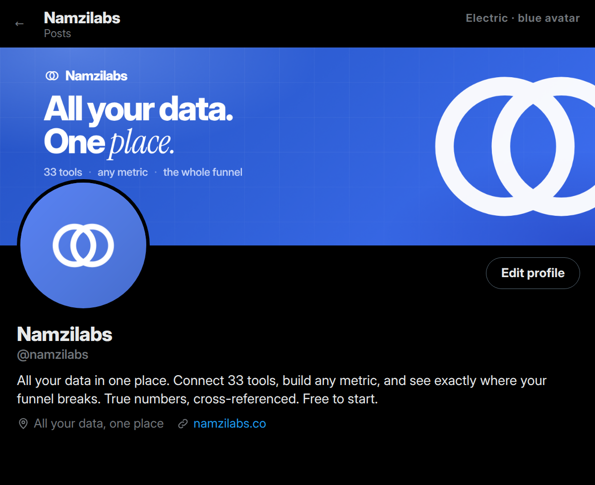
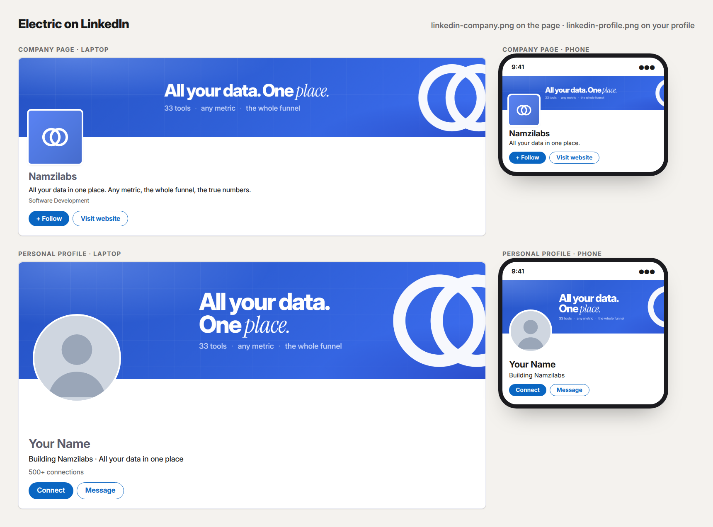

# Banners and profile kits

Thirty-five banner designs, each exported at the exact size every platform asks for, and each with the profile picture made to go with it. Ten are for every day and lead with the core message: **all your data in one place, any metric, where the funnel breaks, the true numbers.** Sixteen play famous games, films and series (a maze chase, a pixel platformer, a VS screen, an opening crawl…), six are memes, and three are made for LinkedIn first. There are also Instagram highlight covers.

The **Banner Kit** shows all of them sorted by platform (LinkedIn company, LinkedIn profile, Facebook page, Facebook group, X, YouTube, link preview, email), each at the platform's real shape with its profile picture roughly where your photo sits, and downloads a whole platform in one go. The Brand Kit links to it.



## LinkedIn: which file goes where



LinkedIn is the one platform where the wrong file really shows: it crops a banner to its own shape, then puts the page logo or your photo over the bottom-left. **Don't upload the X header to LinkedIn.** Every design has two LinkedIn files:

| File | Upload it to | LinkedIn shows it at | Covered by | Phones show |
|---|---|---|---|---|
| `*/linkedin-company.png` (2256×382) | A **company page**: Edit page → Cover image | 1128×191 | the page logo, bottom-left (about 190×90 px) | the middle ~900 px |
| `*/linkedin-profile.png` (3168×792) | Your **personal profile**: the pencil on your background photo | 1584×396 | your photo, bottom-left (about 570×265 px) | the middle ~1,200 px |

Both are saved at twice LinkedIn's size, so text stays sharp on retina screens; LinkedIn scales them down. In both, every word and every picture sits in the safe zone (right of the logo or photo, inside what phones show), and only background art runs to the edges. There's a mock-up of each design on a company page and a profile, laptop and phone, in [`mockups/linkedin-*.png`](mockups/).

## Pick a kit

Each kit is a banner and the avatar that goes with it. There's a mock-up of each on an X profile and on LinkedIn in [`mockups/`](mockups/).

**Everyday**

| Kit | Headline | Profile picture | Use it for |
|---|---|---|---|
| **Electric** ⭐ | Brand blue, the mark big: "All your data. One *place.*" | `../logos/01-between-mono/profile-blue-1024.png` | The main account on every platform |
| **Funnel** | Ink, a cross-tool funnel with the leak: "See where your funnel *breaks.*" | `../logos/01-between-mono/profile-ink-1024.png` | LinkedIn and the founder's profile |
| **Sources** | Paper, 12 tool marks around the logo: "33 tools. One *place.*" | `../logos/01-between-mono/profile-ink-1024.png` | Explaining the product in one look |
| **Namzi** | Sky, the mascot: "True numbers, not *blurry* ones." | `../mascot/avatars/namzi-avatar-sky.png` | Launch weeks and a playful account |
| **Minimal** | Ink, just the lockup and the line | `../logos/variants/midnight-1024.png` | A quiet profile |
| **Formula** | Paper, two formulas across tools: "Build any metric, across any *tool.*" | `../logos/variants/hairline-1024.png` | Founders and ops people who think in metrics |
| **Glass** | A frosted card sharpening a blurry number: "See your business *clearly.*" | `../logos/variants/glass-1024.png` | A softer, premium look |
| **Neon** | Dark, glowing rings: "Stop building *blind.*" | `../logos/variants/neon-1024.png` | Builders, indie hackers, late-night X |
| **Big type** | The words are the picture: "Every tool. One *place.*" | `../logos/variants/bold-1024.png` | Maximum clarity from across a feed |
| **Blueprint** | A technical drawing of two tools and one person: "Built to count everyone *once.*" | `../logos/variants/blueprint-1024.png` | Technical buyers, agencies |

**Memes**

| Kit | Headline | Profile picture | Use it for |
|---|---|---|---|
| **Precious** | The two rings as heavy gold bands (rendered in 3D), side by side and overlapping like the mark, with a glowing inscription, in front of a fiery volcano: "One place to rule them all." | `../logos/variants/precious-1024.png` | Launch week, a nerdy crowd |
| **Donut daydream** | A yellow cartoon hand holding a bitten pink donut, dreaming of two donuts overlapping like the logo, under a cartoon sky: "Mmm… all your data in one *place.*" | `../logos/variants/donuts-1024.png` | Fridays, a playful profile |
| **Wedding** | Gold and platinum rings: "Your Stripe and your CRM, finally *married.*" | `../logos/variants/wedding-1024.png` | Announcing a new integration |
| **Galaxy brain** | Four levels, each ring brighter: checking Stripe → 14 tabs → a spreadsheet → all of it, one place | `../logos/variants/cosmic-1024.png` | Meme weeks on X |
| **Starter pack** | 14 tabs, #REF!, "quick question…", a VLOOKUP, three answers, Monday 11:48 am | `../logos/variants/sticker-1024.png` | Relatable, shareable |
| **Expectation vs reality** | A tidy funnel next to a tangle of tools | `../logos/variants/sketch-1024.png` | Sales and ops audiences |

**Made for LinkedIn** (the two LinkedIn sizes only)

| Kit | Headline | Profile picture | Use it for |
|---|---|---|---|
| **Leaky funnel** | The funnel as a pipe, leaking between booked and held: "Your funnel has a *leak.*" | `../logos/01-between-mono/profile-ink-1024.png` | Sales and agency founders on LinkedIn |
| **Tool wall** | A wall of the tools Namzilabs connects around one card: "33 tools. One *place.*" | `../logos/01-between-mono/profile-paper-1024.png` | The company page |
| **Team** | Brand blue, the mark and the URL: "Building *Namzilabs.*" | `../logos/01-between-mono/profile-blue-1024.png` | Everyone who works at Namzilabs, on their own profile (with their own photo) |

**Games & films** (every size but the link preview and email; code in [`pop.js`](pop.js))

| Kit | The joke | Profile picture | Use it for |
|---|---|---|---|
| **Platformer** | A pixel level: Namzi head-butts a row of app blocks (Stripe, Calendly, your CRM, Shopify, Sheets) and each tool flies down a pipe marked ONE PLACE. The dialog box: "Thank you! But your revenue is in another tab. *Not anymore: Namzilabs puts all your data in one place.*" | `../logos/variants/coins-1024.png` | The playful main banner |
| **Maze chase** | Our ring as a chomper, eating spreadsheet bugs (DUPE, TEST $1, #REF!): "Eat the duplicates." | `../logos/variants/chomper-1024.png` | Double counting, for sales and ops |
| **The cave** | Two fires, Namzi and the gold rings: "It's dangerous to report alone! Take this." / "Take this: all your data in one place." | `../logos/variants/cave-1024.png` | Launch week, gamers |
| **Wild no-show** | A turn-based battle against a calendar invite with legs; the menu says FIND LEAK, MATCH, COUNT ONCE: "A wild no-show appeared!" | `../logos/variants/pixel-1024.png` | Sales teams: show rate |
| **Versus** | A fighting-game VS screen, 64 vs 71 customers, REFEREE: 61: "Stripe vs your CRM." | `../logos/variants/fighter-1024.png` | Cross-referencing, in one look |
| **Crafting** | A crafting grid: Stripe revenue + Fathom held calls = $182: "Craft any metric." | `../logos/variants/diamond-1024.png` | Custom metrics |
| **Falling blocks** | Tool-logo blocks clearing a line: "Finally, everything fits." | `../logos/variants/blocks-1024.png` | 33 tools, one place |
| **Revenue puzzle** | A daily word puzzle played with revenue: the CRM, the sheet and the board deck guess wrong, Namzilabs gets 46180 in one: "Stop guessing your revenue." | `../logos/variants/split-1024.png` | Founders, finance |
| **Achievement** | Unlock toasts: counted once, 33 tools, found where the funnel breaks: "Achievement unlocked: the true numbers." | `../logos/variants/gradient-1024.png` | Clean enough for any LinkedIn |
| **Game over** | GAME OVER, BOOKED 412 > HELD 263, CONTINUE? 9, INSERT COIN: FREE TO START: "Your funnel just lost a life." | `../logos/variants/chomper-1024.png` | Funnel leaks, with a CTA |
| **Emergency meeting** | A voting screen: the 3 test payments were the impostor: "Who's double counting your customers?" | `../logos/variants/cosmic-1024.png` | Double counting |
| **Red pill** | Code rain of numbers and two pills: "Take the red pill. See your real numbers." | `../logos/variants/coderain-1024.png` | Builders, late-night X |
| **Opening crawl** | Stars and a receding crawl, "Episode IV: a new dashboard": "A long time ago, in a spreadsheet far, far away…" | `../logos/variants/midnight-1024.png` | May the 4th, launch day |
| **Need for speed** | Jets at sunset and a HUD timing form → first call: "The need for speed to lead." | `../logos/variants/synthwave-1024.png` | Speed to lead, for sales |
| **Bigger spreadsheet** | A chart line that turns into a fin, a boat with a FINAL_v7 sail and a whole spreadsheet under the water: "You're gonna need a bigger spreadsheet." | `../logos/variants/lifebuoy-1024.png` | Anyone drowning in exports |
| **Christmas lights** | Lights over letters painted on the wallpaper, WHERE IS IT? / RIGHT HERE: "Still asking the walls where your numbers are?" | `../logos/variants/lights-1024.png` | Monday reporting pain |

These are homages: each borrows a format everybody knows and a line or joke about it, never the characters, sprites, names, logos, music or lettering. Namzi and the two rings play every part, the enemies are our own spreadsheet bugs and a calendar invite, and the pipe is blue with our logo on it. Owned characters (the plumber, the yellow chomper, the cartoon family) stay out on purpose: in an ad for a product they'd be infringement, not parody, and the fastest way to get a post or a page taken down. The pixel type is Press Start 2P (OFL) and the marker type Permanent Marker (Apache 2.0), both in `assets/fonts/` with their licences. Every number is example data.

Precious and Donut daydream are parodies. "One place to rule them all" plays on a famous line, and "Mmm… [food]" on a famous cartoon dad (the hand is our own drawing, not his). Both borrow only the common phrase: no characters, film or show art, lettering or logos. The rings' inscription is our own words in a generic script (Great Vibes, OFL), the headline face is Cinzel (OFL), and the volcano is a generic one (no tower, no eye). If you'd rather not borrow them, use the Wedding or Neon kit instead.

## Every size

| File | Size | Where | Safe area |
|---|---|---|---|
| `*/x.png` | 1500×500 | X header | The profile picture covers the bottom-left, so the words sit top-left. |
| `*/linkedin-company.png` | 2256×382 (1128×191 at 2x) | LinkedIn company page cover | The page logo covers the bottom-left and phones show the middle ~900 px, so everything sits in x 352 to 1004 (at 1x). |
| `*/linkedin-profile.png` | 3168×792 (1584×396 at 2x) | LinkedIn personal profile background | Your photo covers the bottom-left 568×264 and phones show the middle ~1,200 px, so everything sits in x 612 to 1384 (at 1x). |
| `*/facebook.png` | 1640×624 | Facebook page cover | Phones crop the sides, so the words start at x=300 (380 in the newer designs), centred top to bottom. |
| `*/facebook-group.png` | 1640×856 | Facebook group cover | Same side crop as the page cover; the words are centred top to bottom. |
| `*/youtube.png` | 2560×1440 | YouTube channel art | Everything important sits in the middle 1546×423, the only part phones show. Desktops show that full-width band (y 508 to 931), so scenes with ground or a horizon put it inside the band. |
| `*/og.png` | 1200×630 | Link preview when someone shares namzilabs.co (X, LinkedIn, Facebook, Slack, iMessage) | Set it as the site's `og:image`. |
| `*/email.png` | 1200×300 | Email-signature banner | Display it at 600×150. |
| `highlights/blue/*.png`, `highlights/ink/*.png` | 1080×1920 | Instagram highlight covers: Start here, Metrics, Funnels, 33 tools, Namzi, FAQ | The icon sits inside the centre circle Instagram shows. |

The memes and the games & films come in the first six sizes only: the link preview and email signature should stay on-brand, so use an everyday design for those. The three LinkedIn designs come in the two LinkedIn sizes only.

Instagram, TikTok and Threads don't have banners. On those, the profile picture, the highlight covers and the pinned post (video 11 and post 35) do the job.

## The logo

**01 Between, mono** is the mark: two tools as two rings, overlapping, in one colour, with the space between them left empty. Profile pictures (1024×1024, full-bleed; platforms crop them to a circle) are in `brand/logos/01-between-mono/`:
- `profile-{blue,ink,sky,paper}-1024.png`
- the eclipse alternate: `eclipse-profile-*.png`
- app icons: `app-icon-*.svg`
- lockups: `lockup-ink.svg` and `lockup-white.svg`

The 33 variants (neon, glass, gold, wedding rings, donuts, and nine game-style ones: chomper, 8-bit coins, diamond rings, falling blocks, code rain, fighter, synthwave, the cave and Christmas lights) are in `brand/logos/variants/`, each as an SVG and a 1024px PNG (Precious, a 3D render, is PNG only). The tables above say which one goes with which banner. For the website, use the transparent files in [`../logos/transparent/`](../logos/transparent/) and the icons in [`../logos/web/`](../logos/web/).

## Bio copy

Every bio, tagline and company description lives in [`../COPY.md`](../COPY.md), checked against each platform's character limit, with copy buttons in the Content Kit. The ones to paste on day 1:

**Instagram and Threads**
```text
Stripe, Calendly & your CRM in one place 📍
See your real show rate & where your funnel leaks
Free to start, no card ⬇️
```

**X**
```text
All your data in one place 📍 Connect Stripe, Calendly, your CRM + 30 more tools, count every customer once, see where your funnel leaks. Free to start ⬇️
```

**LinkedIn company tagline**
```text
All your data in one place. Connect your tools, count every customer once, see exactly where your funnel breaks.
```

**Facebook page intro**
```text
All your data in one place. Connect your tools, see where your funnel leaks. Free to start, no card.
```

**TikTok**
```text
All your sales data in one place 📍 Find your funnel leaks. Free ⬇️
```

The LinkedIn About, the YouTube channel description, the website and Product Hunt copy, and the DM replies for every comment keyword are in [`../COPY.md`](../COPY.md).

## Re-render

```bash
node tools/render-stills.mjs brand/logos/one-ring/rings.html brand/logos/one-ring --ss 1 --alpha   # the 3D gold rings, first
node tools/render-stills.mjs brand/banners/banners.html brand/banners                        # every banner, every size (LinkedIn at 2x)
node tools/render-stills.mjs brand/banners/banners.html brand/banners --query "only=neon"    # one design
node tools/render-stills.mjs brand/banners/banners.html brand/banners --query "only=platformer,arcade"   # games & films (pop.js)
node tools/render-stills.mjs brand/banners/banners.html brand/banners --query "sizes=linkedin-company,linkedin-profile"   # just the LinkedIn files
node tools/render-stills.mjs brand/banners/highlights.html brand/banners --ss 1             # Instagram highlight covers
node tools/render-stills.mjs brand/banners/kits.html brand/banners --ss 1                   # X profile mock-ups
node tools/render-stills.mjs brand/banners/linkedin.html brand/banners --ss 1               # LinkedIn mock-ups
```

Each banner is built from one config in `banners.html`: the platform's size, where its words go, and where its picture goes. LinkedIn layouts live in each design's `li()` and stay inside `ZONE`. The games & films share one layout (`POP_BOX` in `banners.html`): each design in `pop.js` draws a background, a picture and the words, and a long headline shrinks until it fits its box, so it can't run under a profile photo. Change a line there and re-render.
