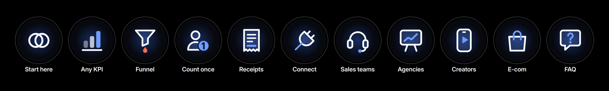
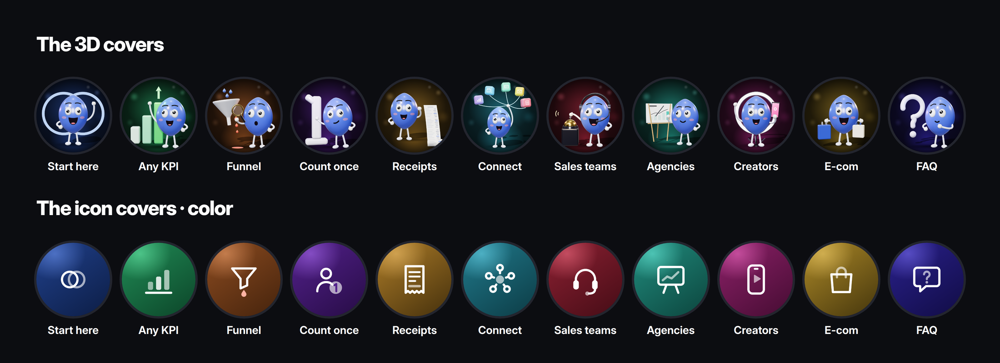
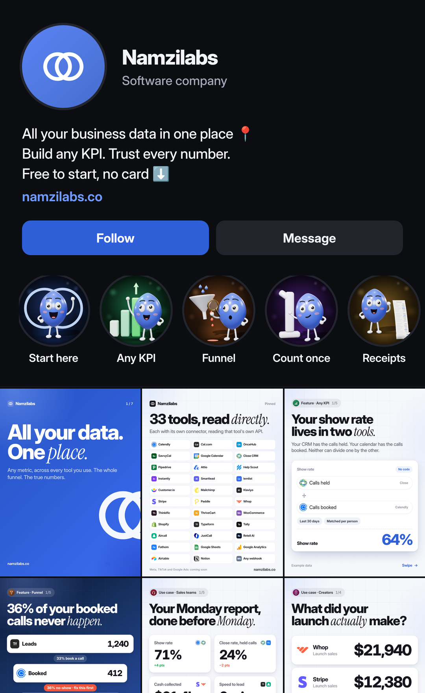

# Instagram highlights

Eleven highlights, in the order someone landing on the profile needs them: **what it is**, then **the five features**, then **the four use cases** (one per audience), then **the FAQ**. Every highlight is a short run of stories that ends in one ask, and every one has a cover to match, in two styles.



| # | Highlight | What it's for | Stories | The ask |
|---|---|---|---|---|
| 01 | **Start here** | What Namzilabs is, in seven taps: your tools disagree, all your data in one place, any KPI, where the funnel breaks | 7 | Link sticker: start free |
| 02 | **Any KPI** | The metric builder: a number that lives in two tools, three steps, ideas to steal | 6 | Link sticker |
| 03 | **Funnel** | Where it breaks: each tool sees one step, one person per row, split by setter | 6 | Link sticker |
| 04 | **Count once** | Matching: dave@, Dave M. and Dave Miller are one person; rows become people | 5 | Link sticker |
| 05 | **Receipts** | Proof: every number shows its working, and it never edits your data | 5 | Link sticker |
| 06 | **Connect** | Does it work with my stack? The whole list, how connecting works, the webhook, what's coming | 6 | Link sticker |
| 07 | **Sales teams** | Use case: Monday 9:07, the live scorecard, by setter and closer, booked vs held | 6 | Reply SHOWUP |
| 08 | **Agencies** | Use case: held meetings, cost per held meeting per client, the receipt for the report | 5 | Reply HELD |
| 09 | **Creators** | Use case: three dashboards into one launch number, then the numbers creators want | 5 | Reply LAUNCH |
| 10 | **E-com** | Use case: every tool takes credit; revenue from your list, matched, not attributed | 5 | Reply LIST |
| 11 | **FAQ** | Free? Code? My data? My tools? Ads and AI? | 7 | Reply with a question |

The numbers are one example business all the way through (1,240 leads, 412 booked, 263 held, 64 paid; the creators' $43,000 launch; the store's $29.4k from its list), the same as the posts, and every frame with numbers says "Example data".

## Put them up

1. **Build them from the last to the first.** Instagram puts the highlight you added to most recently at the front of the row. So post and save FAQ first and Start here last, and Start here ends up first.
2. **Post the stories in order**, one story per frame (`NN-name/story-01.png`, `story-02.png`…). Posting a highlight's stories over a day or two also reaches the people who already follow you.
3. **Add the sticker** where the table below says. The frames leave room for it: the link sticker goes under the "Tap the link" arrow.
4. **Save them to a new highlight** named exactly as in the table. The short names fit under the circle.
5. **Set the cover**: Edit highlight → Edit cover → pick the cover from your camera roll. Use one set for every circle: [`covers/3d/`](covers/3d/) or one colourway of [`covers/icons/`](covers/icons/).
6. **Set up the replies.** A reply to a story is a DM, so the use-case highlights ask people to reply with a keyword (SHOWUP, HELD, LAUNCH, LIST). The DM for each is in [`brand/COPY.md`](../brand/COPY.md). Answer by hand while it's quiet, or set it up in ManyChat.

## Stickers

| Highlight | Story | Sticker |
|---|---|---|
| Start here | 7 | Link sticker (namzilabs.co), under the arrow |
| Any KPI | 5 | Poll: "Which would you build first?" (Show rate / Cash collected) |
| Any KPI | 6 | Link sticker, under the arrow |
| Funnel | 3 | Question: "Where does your funnel leak?" |
| Funnel | 6 | Link sticker, under the arrow |
| Count once | 5 | Link sticker, under the arrow |
| Receipts | 5 | Link sticker, under the arrow |
| Connect | 2 | Question: "Which tool should be next?" |
| Connect | 6 | Link sticker, under the arrow |
| Sales teams | 2 | Poll: "How long does your Monday report take?" (Under 30 min / Over an hour) |
| Creators | 2 | Poll: "Do your dashboards agree?" (Yes / Never) |
| E-com | 2 | Poll: "Which number do you report?" (Klaviyo / Shopify) |
| FAQ | 7 | Question: "Ask us anything" |

The use-case highlights end on "Reply below" with the keyword; they don't need a sticker.

## Covers

Two sets. Pick one and use it for all eleven.

- **3D** ([`covers/3d/`](covers/3d/)): Namzi, in 3D, in a small lit scene per highlight: standing in the overlap of the two rings (Start here), pointing at a rising chart (Any KPI), studying a leaking funnel (Funnel), leaning on a giant 1 (Count once), holding a receipt that reaches the floor (Receipts), holding every tool like balloons (Connect), in a headset ringing the sales bell (Sales teams), presenting a client report (Agencies), in front of a ring light (Creators), carrying shopping bags (E-com), and thinking next to a question mark (FAQ). Playful and character-led; each has its own colour.
- **Icons** ([`covers/icons/`](covers/icons/)): one clean icon per highlight, drawn on one grid with one stroke weight and one accent, in four colourways: **blue**, **ink**, **paper** and **color** (each highlight's own colour, matching the 3D set). Previews of the whole row: [`covers/icons/rows/`](covers/icons/rows/).





All covers are 1080×1080, with everything that matters inside the circle Instagram crops them to.

## The posts that go with them

Posts 45 to 52 are the same features and use cases as feed carousels, built from the same frames: [45 Any KPI](../posts/45-any-kpi/), [46 Funnel](../posts/46-find-the-leak/), [47 Count once](../posts/47-count-once/), [48 Receipts](../posts/48-show-the-receipt/), [49 Sales teams](../posts/49-sales-team-monday/), [50 Agencies](../posts/50-agency-reporting/), [51 Creators](../posts/51-launch-number/) and [52 E-com](../posts/52-list-revenue/). A post can point to its highlight ("the full walkthrough is in the Funnel highlight"), and the highlight backs the post up.

## Re-render

```bash
node tools/render-stills.mjs highlights/covers.html highlights/covers/3d --ss 2        # the 3D covers (three.js)
node tools/render-stills.mjs highlights/icons.html highlights/covers/icons --ss 2      # the icon covers, all four colourways
node tools/render-stills.mjs highlights/stories.html highlights --ss 2                 # every story
node tools/render-stills.mjs highlights/stories.html highlights --ss 2 --query "only=funnel"   # one highlight
node tools/render-stills.mjs highlights/profile.html highlights/covers --ss 2          # the profile previews
```

Where things live: the stories are written in [`stories.js`](stories.js) (every frame's words and numbers, the purpose of each highlight and its stickers); the pieces they're built from are [`lib/story.js`](../lib/story.js) and [`lib/story.css`](../lib/story.css); the icons are [`lib/hlicons.js`](../lib/hlicons.js); 3D Namzi is [`lib/namzi3d.js`](../lib/namzi3d.js) and the props are [`lib/props3d.js`](../lib/props3d.js).
