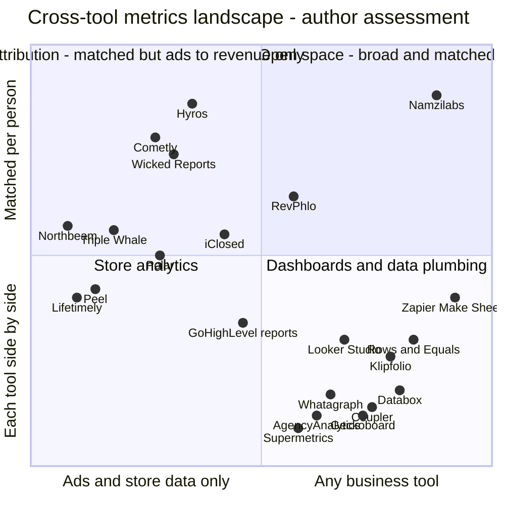

# ICP and competitor positioning for Namzilabs

*Research file 04 for the Namzilabs content engine. Compiled September 2026.*

> **How to read this document**
> - Every figure, price and quote has a numbered source `[n]`. The list is in section 10. Quotes appear as they do in the cited source.
> - **Inference** marks our own reading. No source reported it.
> - **Unverified** marks background knowledge that was not re-checked in this pass, such as influencer names or a competitor's general positioning. Check it before republishing.
> - **Method:**
>   - About 45 targeted web searches covered the Shopify Community forum, G2, Trustpilot, the Shopify App Store, vendor pricing pages and docs, podcasts and third-party round-ups.
>   - The research environment could not open Reddit, X or most vendor sites directly. Facts therefore come from search-engine extracts of the cited pages.
>   - Customer voice relies mostly on forum thread titles, review sites, and round-ups that quote Reddit.
> - **Pricing changes often.**
>   - Prices are as reported in 2026 sources. Where sources disagree, the range is shown with every source.
>   - Pricing for dashboards and data-plumbing tools could not be verified, so it is left blank rather than guessed (sections 3.3 and 3.4).
> - **Many review pages come from rivals.** Rival vendors write many of the pages that rank for "[tool] pricing" or "[tool] reviews". They are marked *(vendor)* in the sources and treated as reported claims.

## Contents

1. [Executive summary](#1-executive-summary)
2. [ICP deep dives](#2-icp-deep-dives)
3. [Competitor teardown](#3-competitor-teardown)
4. [Positioning map](#4-positioning-map)
5. [White space and positioning per ICP](#5-white-space-and-positioning-per-icp)
6. [Messaging hierarchy](#6-messaging-hierarchy)
7. [Objection handling](#7-objection-handling)
8. [Category naming options](#8-category-naming-options)
9. [What we could not verify, and next steps](#9-what-we-could-not-verify-and-next-steps)
10. [Sources](#10-sources)

---

## 1. Executive summary

- **Lead with high-ticket coaching and info-product teams (ICP b).**
  - **Their pain is a cross-tool problem.** Bookings live in Calendly. Outcomes live in the CRM or in a closer's end-of-day (EOD) report. Cash lives in Stripe or Whop.
  - **The status quo is manual.** Tools sold to this market pitch replacing manual EODs and spreadsheets [47]. Zapier lists templates just to post setter EOD reports [53] and to log no-shows [54].
  - **Namzilabs already covers the stack, with no ad connector needed:** Calendly, Cal.com, Close, Pipedrive, Stripe, Whop, Typeform, Aircall, JustCall and Fathom are live, and GoHighLevel connects through a workflow webhook.
- **The incumbents in that space sell something adjacent.**
  - **Attribution tools (Hyros, Cometly, Wicked Reports)** trace *ad clicks* to revenue. Their pricing sits behind a demo, scales with ad spend or tracked revenue, or starts around $500/month [66][67][73][74][78].
  - **Sales-floor tools lock you into one platform.**
    - iClosed's analytics come with switching to its scheduler [48][49].
    - GoHighLevel's custom reports are limited to its own widgets [56].
    - Closers.io's tracking is bundled with its training and recruitment services [44][45][46].
  - **The closest direct competitor is RevPhlo**, which sells "post-booking sales intelligence for high-ticket teams" [47].
- **Trust is the real problem in this category, so "every number shows its working" is the sharpest wedge.** Three signals point the same way:
  - Vendors now tell Shopify owners that a 20–40% gap between Meta and Shopify is normal [6][7].
  - G2 reviewers of Triple Whale say they check its numbers by hand [20].
  - Cole Gordon, founder of Closers.io, calls close rate "an easily manipulated metric" [42].

  A number that lists the records it counted, the ones it left out, and why, answers all three.
- **E-commerce has the loudest pain and the most crowded field, and Namzilabs has a connector gap there.**
  - **The pain:** "numbers don't match" is the most common merchant complaint found [1]–[5].
  - **The field anchors on free tiers,** such as Triple Whale's free Founders Dash [17] and Lifetimely's free plan under 50 orders a month [36].
  - **The gap:** Namzilabs' Meta, TikTok and Google Ads connectors are not live yet. **Do not lead with ROAS or MER until they are.**
  - **The wedge for now** has three parts:
    - matched Klaviyo × Shopify revenue, meaning what a subscriber is actually worth;
    - quiz-to-order revenue;
    - WooCommerce stores, since the e-com tools reviewed here are Shopify-first [23][29][40] (**Inference**).
- **Creators have "three dashboards and no total" [86].**
  - **Platform analytics are mostly aggregate.** They can't see what happens in other tools [84][86].
  - **Namzilabs fits some creators today:** those who sell through Whop, Stripe, Thinkific or ThriveCart and email through Mailchimp, Klaviyo or Customer.io.
  - **It has no native Kajabi, beehiiv or Kit connector.** Target accordingly.
- **For agencies, the wedge is outbound and appointment-setting agencies, not paid-media agencies** (**Inference**).
  - Instantly, Smartlead, lemlist, the calendars and Fathom are all live. So "meetings held, not just booked" can be proven to clients today.
  - Paid-media reporting waits for the ad connectors.
- **AI features are now standard, so AI should not be the headline.**
  - Competitors all ship some AI:
    - Polar ships an AI assistant [28];
    - Lifetimely sells a "Profit Agent" [37];
    - Wicked Reports' top plan adds AI tools [78];
    - a product called MCP Analytics already exists [41].
  - **How to position MCP:** "your AI reads the same audited numbers you do", not the reason to buy.
- **The unclaimed space combines four things for teams without an analyst:**
  - broad cross-tool coverage;
  - matching on the same person;
  - auditable numbers;
  - self-serve and free to start, with no warehouse.

  Each rival covers only part of it:
  - dashboards are broad but show each tool's numbers side by side;
  - attribution tools match people, but only along the ad-to-revenue path, and they are sold by sales teams;
  - vertical tools are locked to one platform.

### Hero metric per ICP

| ICP | Hero metric to lead with | Live today? |
|---|---|---|
| (b) High-ticket coaching and info-product teams | **Show rate**: calls held ÷ calls booked, matched per lead | Yes |
| (d) Outbound and appointment-setting agencies | **Cost per held meeting**, per client and campaign | Yes. Costs come from a Google Sheet; ad spend is coming soon |
| (c) Creators | **Revenue per subscriber**, by list, lead magnet or launch | Yes, for Mailchimp, Klaviyo or Customer.io + Stripe, Whop, Thinkific or ThriveCart |
| (a) E-commerce / DTC | **Revenue per subscriber**, from Shopify orders matched to Klaviyo subscribers. Switch to **MER / true ROAS** when the ad connectors ship | Yes. MER and ROAS are coming soon |

### Recommended positioning line

> **Namzilabs: the numbers between your tools, with the working shown.**
>
> *Connect your tools. Namzilabs matches the same person across them and builds the numbers no single tool can: show rate, speed to lead, cash per booked call, revenue per subscriber. Every number shows exactly what it counted.*

---

## 2. ICP deep dives

### At a glance

| | (a) E-commerce / DTC | (b) High-ticket coaching and info | (c) Creators | (d) Small agencies and owners who report to clients |
|---|---|---|---|---|
| Typical stack | Shopify or WooCommerce, Klaviyo, Meta ads, GA4 | Ads, application form, Calendly or GHL calendar, Zoom plus Fathom, Close or GHL, Stripe or Whop | An email tool, Stripe, Whop or a course platform, a community | The client's tools, outbound or ad platforms, Sheets, a reporting tool |
| Metric they obsess over | MER / blended ROAS, new-customer CAC | Show rate, close rate, cash collected, cost per booked call | Revenue per subscriber, MRR and churn | Cost per lead or per meeting, ROAS for paid media |
| Namzilabs coverage today | Partial. Store, email and GA4 are live; the ad platforms are coming soon | Strong | Partial. Whop, Stripe, Thinkific, ThriveCart, Mailchimp, Klaviyo and Customer.io are live; Kajabi, beehiiv and Kit are not | Strong for outbound (Instantly, Smartlead, lemlist). Paid media waits for the ad connectors |
| Suggested priority (**Inference**) | 4th for now; revisit when the ad connectors ship | **1st (beachhead)** | 3rd | 2nd (outbound and appointment-setting agencies) |

### 2.1 (a) E-commerce / DTC brand owners (Shopify, Klaviyo, Meta ads)

**Who.**
- Founder-led Shopify or WooCommerce brands running Meta ads, Klaviyo email and SMS, and GA4.
- Since Apple's iOS privacy changes, ad platforms estimate conversions instead of observing them. Vendors now say this openly to merchants [9].

**Namzilabs today.**
- **Live:** Shopify, WooCommerce, Klaviyo, Mailchimp, GA4, Stripe, Typeform, Tally, Help Scout, Google Sheets.
- **Coming soon:** Meta Ads, TikTok Ads, Google Ads. They are built and awaiting platform approval.
- **Rule:** any e-com message about ROAS or MER must say "coming soon".

**In their own words**

| Phrase | Source | Type |
|---|---|---|
| "GA4 and Shopify conversions/sales don't match" | Shopify Community thread title [1] | Merchant |
| "Why is GA4 showing less revenue than my sales channel?" | Shopify Community thread title [2] | Merchant |
| "Anyone else seeing missing conversions in Ads Manager?" | Shopify Community thread title [3] | Merchant |
| "Meta - Purchases coming in with no revenue associated" | Shopify Community thread title [4] | Merchant |
| "Add to cart and Purchase not getting attributed to Meta Advert" | Shopify Community thread title [5] | Merchant |
| "Facebook says you got 50 conversions. Shopify shows 12 orders. Which is true?" | Shopify App Store listing for an attribution app [9] | Vendor copy written in the merchant's voice |

G2 reviewers of Triple Whale describe unreliable metrics that they have to check by hand [20]. This is a paraphrase of the G2 summary; the page could not be opened directly.

**Top 5 pains**
1. **No number to trust.**
   - Each tool counts something different [6][7][8]:
     - Shopify counts orders;
     - Meta counts conversions inside its own attribution window (7-day click, 1-day view);
     - Google Ads counts inside its own window (30-day click);
     - GA4 counts only the sessions it managed to follow.
   - Add up the revenue each platform claims and it always exceeds what Shopify collected.
   - Vendor explainers now tell merchants that a 20–40% gap between Meta and Shopify is normal [6][7].
2. **True ROAS and CAC per channel can't be known, so owners fall back on blended MER** (total revenue ÷ total marketing spend) [13].
   - MER usually lives in a spreadsheet. Owners buy daily MER calculator templates [10][11].
   - Free blended-ROAS calculators are a common lead magnet [12].
3. **Paying for an analytics tool that adds one more disagreeing number.**
   - G2 reviewers of Triple Whale report inaccurate data [20].
   - Its Shopify App Store reviews are polarized: about 4.1/5, with roughly 18% one-star reviews [23].
4. **Pricing that rises with revenue, plus contracts.**
   - Triple Whale prices on annual GMV and the package chosen [15][16].
   - Third-party reviewers say price increases and annual-contract lock-in are the complaint customers report most [21][22].
   - This includes one operator's reported mid-contract jump from $329 to $549 a month [21][22].
5. **Tools built for brands with an analyst.**
   - Reviewers tell brands under roughly $500K a year without a dedicated analytics owner to stay on free tiers [14][24].
   - They save paid tiers for much larger brands [14][24].

**The metric they obsess over.**
- MER / blended ROAS [13], followed by new-customer CAC and LTV (**Inference**, consistent with [13]).
- None of these can be built in Namzilabs until the ad connectors ship.

**Where they hang out.**
- **Found in this pass:**
  - Shopify Community forums [1]–[5].
  - The Shopify App Store, G2 and Trustpilot, when they vet tools [20][23][24].
- **Unverified:**
  - r/shopify, r/ecommerce, r/FacebookAds, r/PPC.
  - "Ecom Twitter" on X.
  - DTC newsletters and podcasts.

**Who they follow** (Unverified).
- Taylor Holiday (Common Thread Collective).
- Nik Sharma.
- Cody Plofker (Jones Road Beauty).
- Ezra Firestone (Smart Marketer).
- Kurt Elster (The Unofficial Shopify Podcast).
- Chase Dimond (email).
- Triple Whale is the loudest vendor voice. It uses a free tier, comparison content and a live BFCM dashboard [17][25][26].

**The words they use.**
- "Numbers don't match" [1].
- MER, blended ROAS [13].
- "True ROAS", which one vendor has taken as its name [8].
- Attribution window [6].
- "Source of truth", which spreadsheet templates use as a selling point [10][11].
- Pixel, CAPI, nCAC, contribution margin (Unverified).

**Their objections to a new tool** (**Inference** unless cited).
- "Triple Whale's free plan is good enough" [14][17].
- "Every tool gives me a different number" [20].
- "The price creeps up with GMV" [15][21].
- "I don't want another pixel or app on my store."
- "Do you even have Meta?" For Namzilabs, not yet.

**What makes them switch** (**Inference** unless cited).
- A price jump at renewal or on moving up a GMV tier [15][21][22].
- A trust incident, when the dashboard disagrees with Shopify [20].
- An annual contract ending [21].
- Planning for Black Friday / Cyber Monday (BFCM).
- Running on, or moving to, WooCommerce.

**Implication for Namzilabs.**
- **Don't fight the attribution war now.** Win on "matched and explained": what a Klaviyo subscriber is actually worth in Shopify orders, with every order listed.
- **Bring MER and true ROAS, with the working shown, once the ad connectors are live.**
- **WooCommerce stores may be under-served,** because the tools reviewed here are Shopify-first [23][29][40] (**Inference**; verify each competitor's WooCommerce support).

### 2.2 (b) Info-product owners and coaches with high-ticket sales teams

**Who.**
- Coaching, consulting and info-product businesses that sell offers of roughly $5K–$25K by phone.
- "Most high ticket sales operations run on a two-role system called the setter-closer model" [62]. Setters qualify leads and book calls; closers sell.
- **A typical stack:**
  - ads;
  - an application form;
  - Calendly, iClosed or the GoHighLevel (GHL) calendar;
  - Zoom calls, often recorded;
  - Close or GHL as the CRM;
  - Stripe, Whop or ThriveCart for payment.
- GHL is often the all-in-one, commonly reported at about $97–$497 a month [63][64].

**Namzilabs today.**
- **Live:**
  - Scheduling: Calendly, Cal.com, OnceHub, SavvyCal, Google Calendar.
  - CRM: Close, Pipedrive, Attio.
  - Payments: Stripe, Whop, ThriveCart.
  - Forms: Typeform, Tally.
  - Calls: Aircall, JustCall, Retell AI, Fathom.
  - Other: Google Sheets, plus the custom webhook (GoHighLevel via workflows).
- **Not native:** GoHighLevel, HubSpot.

**In their own words**

| Phrase | Source | Type |
|---|---|---|
| Close rate is "an easily manipulated metric" | Cole Gordon, founder of Closers.io [42] | Operator / influencer |
| "Why Show Rates Matter" and "The Real Metric: Offers Per Closer Per Day" | Cole Gordon Podcast episode titles [43] | Operator / influencer |
| "They've been crappy with customer service and failed to tell me that they need more money if my revenue gets beyond certain thresholds." | Reddit comment about Hyros, quoted in a review round-up [65] | Customer |
| "Send EOD appointment setter performance report to channel" | Zapier automation template [53] | A workaround people install |
| "Log strategy session no-shows into lead records instantly" | Zapier automation template [54] | A workaround people install |

Tools sold to this ICP describe the status quo the same way:
- RevPhlo pitches replacing manual end-of-day reports and spreadsheets without changing existing tools [47].
- Closers.io includes EOD reporting and call-review routines in its services [44][46].

**Top 5 pains**
1. **The KPIs are self-reported.**
   - Show rate and close rate come from closers' EOD forms, or from CRM stages that someone updates by hand.
   - Cole Gordon warns that reps game close rate, for example by rescheduling. He says he manages on production instead [42].
2. **The tools disagree about the same lead.** This is the "CRM says one thing, Calendly another" problem.
   - **Close and Calendly** [55]:
     - Close creates contacts from round-robin Calendly events only if every host's Calendly account is connected.
     - It does not update fields on contacts that already exist.
   - **GoHighLevel**, per a third-party guide [56]:
     - time zones can put a Monday lead in Tuesday's totals;
     - its custom reports can't combine different metrics in one chart.
3. **No-shows quietly drain the pipeline.**
   - One sales-ops analysis calls the no-show rate the most under-measured number in sales. It estimates that 20–30% of pipeline disappears between booking and showing [60].
   - Teams add automations just to log no-shows [54].
4. **Speed to lead is invisible.**
   - The widely cited MIT/InsideSales finding: leads contacted within 5 minutes are 21× more likely to qualify than leads contacted at 30 minutes [61].
   - The two timestamps usually sit in different tools: the form, and the dialer or CRM (**Inference**).
5. **Seeing cost per call, and the cash behind it, is expensive and complex.**
   - Owners manage to cost per booked call:
     - about $150–$350 in one agency's coaching benchmarks [58];
     - $400–$700 ceilings for $10–12K offers in another's [59].
   - The tools that link ad, call and cash sit behind a demo and price on tracked revenue [66][67].
   - Price is "the most consistent Hyros complaint on Reddit", and setup is demanding [65].

**The metrics they obsess over.**
- **Owners:** cash collected and cost per booked call [58][59].
- **Sales managers:** show rate and close rate [43][49][50].
- **Cole Gordon:** production, and offers per closer per day [42][43].
- **RevPhlo's homepage** leads with cash collected, close rate, show rate and cash per show [47].

**Where they hang out.**
- **Found in this pass:**
  - Operator podcasts such as the Cole Gordon Podcast [43].
  - Trustpilot, when they vet tools [51][72].
- **Unverified:**
  - Operator content on YouTube, X and Instagram.
  - Skool and Whop communities.
  - GoHighLevel Facebook groups.
  - Communities and job boards for remote closers.

**Who they follow.**
- Cole Gordon [42][43].
- Unverified: Alex Hormozi, Jeremy Miner, Iman Gadzhi, Sam Ovens, Alex Becker (Hyros co-founder), Russell Brunson.

**The words they use.**
- Setter, closer [62].
- EOD [53].
- Show rate [43].
- Close rate [42].
- No-show [54].
- Cash collected, cash per show [47].
- Cost per booked call [58].
- Speed to lead [61].
- Offers per closer per day [43].
- Production [42].
- Unverified: DQ (disqualified), "revenue contracted", triage call, application.

**Their objections to a new tool** (**Inference** unless cited).
- "Our EOD sheet works."
- "GHL already has reports" [56].
- "Hyros already tracks calls" [70].
- "My closers won't adopt another tool." Namzilabs reads the tools, so reps enter nothing.
- "Lead and payment data is sensitive."
- "No native GHL connector." True: it runs through a GHL workflow webhook.

**What makes them switch** (**Inference** unless cited).
- Hiring the first setters and closers. The owner then needs KPIs to manage them and pay commission.
- A dispute over commission or performance.
- Scaling ad spend, which makes cost per call matter more.
- An attribution tool moving them up a price tier [65][66].
- Reps no longer filling in their EODs reliably.
- Changing CRM or scheduler.

**Implication for Namzilabs.**
- **This is the beachhead**, for three reasons:
  - the pain is cross-tool by nature;
  - Namzilabs covers the stack today without ad connectors;
  - incumbents either do ad attribution or tie analytics to their own platform (section 3.2).
- **Lead with a show rate that nobody has to self-report.**

### 2.3 (c) Creators (newsletters, communities, courses)

**Who.**
- Solo creators and small teams earning from courses, memberships, communities, sponsorships and digital products.
- Most sell across several platforms at once.

**Namzilabs today.**
- **Live:**
  - Payments and courses: Whop, Stripe, Paddle, Thinkific, ThriveCart.
  - Email: Mailchimp, Klaviyo, Customer.io.
  - Forms: Typeform, Tally.
  - Other: Notion, Airtable, Google Sheets, plus the custom webhook.
- **Not native:** Kajabi, beehiiv, Kit (ConvertKit), Skool, Substack, Gumroad, Teachable. They can only connect by webhook, and only if the tool can send one.

**In their own words**

| Phrase | Source | Type |
|---|---|---|
| "once you need any support, any scale or any reporting you'll find the system very deficient even though you're paying a premium" | Kajabi reviewer on Trustpilot [83] | Customer |
| "Your money might come from Stripe this week, RevenueCat next week, and a Gumroad product sale tomorrow." | Indie developer and creator on DEV Community [87] | Builder |
| "three dashboards and no total" | Metabase, describing creators who sell on several platforms [86] | Vendor copy |

**Top 5 pains**
1. **Revenue is scattered, with no total.**
   - Each platform holds one slice [86][87].
   - Products such as CreatorDash exist just to add it all up after platform fees [88].
2. **Platform analytics only show totals.**
   - CourseLytics says Kajabi's reports show overall trends, not performance by traffic source or cohort [84].
   - Kajabi records opt-in and purchase times but doesn't report the gap between them [84].
   - This is despite Kajabi's promise to show what's working "down to the dollar" [85].
3. **Not knowing what a subscriber is worth.**
   - beehiiv frames subscriber LTV as how long someone subscribes, times the revenue they bring in [89].
   - Estimated subscriber lifetime runs from about 6 to nearly 20 months depending on niche, roughly a 3× difference [90].
   - Creators who combine ads, boosts and subscriptions earn about 3× more than those with a single revenue stream [91].
   - Answering "which stream does each subscriber pay through?" means joining email data to payment data (**Inference**).
4. **Churn without the "why".**
   - Whop's dashboard reports MRR, churn rate and churned revenue [92].
   - It does not say which lead magnet, launch or cohort the people who churned came from (**Inference**).
5. **Launches are tracked by hand.**
   - A launch spans the email tool, forms, a webinar or call, and checkout.
   - No single platform shows that funnel person by person (**Inference**, consistent with [84]).

**The metrics they obsess over.**
- Revenue per subscriber and subscriber LTV [89][90].
- MRR and churn, for memberships [92].

**Where they hang out** (Unverified unless cited).
- X, LinkedIn, YouTube.
- beehiiv and Kit creator communities.
- Whop and Skool.
- Indie Hackers and DEV Community [87].

**Who they follow** (Unverified).
- Justin Welsh, Sahil Bloom, Ali Abdaal, Dan Koe.
- Jay Clouse (Creator Science), Tyler Denk (beehiiv), Nathan Barry (Kit), Pat Flynn.

**The words they use.**
- Subscribers, subscriber LTV [89].
- Revenue per subscriber [90].
- MRR, churn rate, churned revenue [92].
- Take-home after fees [88].
- Launch.
- Unverified: lead magnet, open cart, paid community, "stack".

**Their objections to a new tool** (**Inference** unless cited).
- "My platform already has analytics" [85][92].
- "I'm not a numbers person."
- "Does it work with Kajabi, beehiiv or Kit?" Not natively.

**What makes them switch** (**Inference**).
- Reviewing a launch after it ends.
- Moving platform, for example from Kajabi to Whop or Skool.
- Pricing a sponsorship or ad slot.
- Needing totals at tax time.

**Implication for Namzilabs.**
- **Target creators who sell through Whop, Stripe, Thinkific or ThriveCart** and email through Mailchimp, Klaviyo or Customer.io.
- **Lead with revenue per subscriber** by list, lead magnet and launch.
- **Before a broad creator push,** test webhook templates, or build native connectors, for beehiiv, Kit and Kajabi.

### 2.4 (d) Brand owners and small agencies who report to clients

**Who.**
- Freelancers and small agencies that report results to clients every week or month. This covers paid media, email, outbound and appointment setting, and GoHighLevel resellers.
- Owners who report to partners or investors.

**Evidence note.**
- This pass found no customer quotes specific to agencies.
- The pains below are **Inference** from nearby evidence and need checking in interviews.

**Namzilabs today.**
- **Live:**
  - Outbound: Instantly, Smartlead, lemlist.
  - Scheduling and calls: Calendly, Cal.com, OnceHub, SavvyCal, Fathom.
  - CRM: Close, Pipedrive, Attio.
  - Web and commerce: GA4, Shopify, WooCommerce, Stripe.
  - Other: Google Sheets.
- **Coming soon:** Meta, TikTok and Google Ads.

**Top 5 pains** (**Inference** unless cited)
1. **Building reports takes hours.**
   - Every period, someone pulls each platform's data into a client report.
   - A whole category of tools exists for this (section 3.3), and data vendors publish how-to guides just for automating GHL reports [56].
2. **Platforms report vanity metrics; clients pay for outcomes.**
   - Platforms report clicks, leads and booked meetings. Clients pay for meetings that happen, and for revenue.
   - The gap between booking and showing can be 20–30% of pipeline [60].
3. **Disputes over whose number is right.**
   - Platforms count differently by design [6][7].
   - In lead generation, clients can dispute whether a meeting happened at all.
4. **Tool costs stack up per client.** Unverified: agency reporting tools often charge per client or per data source.
5. **GHL's reporting limits, for agencies that resell GHL** [56].

**The metrics they obsess over** (**Inference**).
- Cost per lead and cost per booked meeting.
- ROAS, for paid-media agencies.
- Meetings booked, for outbound agencies. This is often what they bill on in pay-per-meeting deals.

**Where they hang out** (Unverified).
- r/agency, r/PPC, r/marketing.
- LinkedIn.
- GoHighLevel community groups.
- Cold-email communities.

**Who they follow** (Unverified).
- Iman Gadzhi, Jason Swenk.
- Guillaume Moubeche (lemlist).
- Eric Nowoslawski (cold email).
- Shaun Clark (HighLevel).

**The words they use** (**Inference**).
- Client reporting, white-label, monthly report, retainer.
- Pay-per-meeting, booked vs held, positive replies, CPL.

**Their objections to a new tool** (**Inference**).
- "AgencyAnalytics or Looker Studio already does this."
- "I need white-label." Confirm what Namzilabs supports before promising anything.
- "Clients want to see the platform numbers."

**What makes them switch** (**Inference**).
- Losing a client because the client stopped trusting the reports.
- Onboarding a new client.
- A reporting tool raising its price.
- Launching a pay-per-meeting offer.

**Implication for Namzilabs.**
- **The wedge is outbound and appointment-setting agencies,** because what they deliver is meetings.
- **Report meetings held, not booked, with receipts.**
- **Paid-media agencies come after the ad connectors ship.**

### 2.5 ICP priority (**Inference**)

Scores run from 1 (weak) to 5 (strong). "Openness" means how little competition there is.

| ICP | Pain intensity | Namzilabs coverage today | Openness | Reachability | Suggested order |
|---|---|---|---|---|---|
| (b) High-ticket coaching and info | 5 | 5 | 4 | 4 | **1** |
| (d) Outbound and appointment-setting agencies | 4 | 4 | 4 | 3 | **2** |
| (c) Creators on Whop, Stripe, Thinkific or ThriveCart | 3 | 3 | 3 | 4 | **3** |
| (a) E-commerce / DTC | 5 | 2 until the ad connectors ship | 1 | 4 | **4** (revisit when ads launch) |

---

## 3. Competitor teardown

### 3.1 E-commerce analytics

| Tool | Positioning | Pricing (as reported) | Strengths | Common complaints |
|---|---|---|---|---|
| **Triple Whale** | "Complete intelligence platform for ecommerce", "trusted by more than 60,000 brands" (from its own comparison page) [25]. Offers a free Founders Dash [17] | Free plan, no card needed [15][17]. Paid plans are priced on annual GMV and the package (Foundation, Automate, Enterprise) [15][16]. Third-party 2026 trackers report roughly $129 to $1,290 a month depending on GMV; the figures conflict [18][19] | Best-known brand in the category; free tier feeds its funnel; pixel attribution; AI features paid for in credits [27]; a live BFCM dashboard [26] | Inaccurate data that users check by hand (G2) [20]; polarized App Store reviews, about 18% one-star [23]; price rises with GMV; annual contracts [21][22]; about 3/5 on Trustpilot [21][24] |
| **Polar Analytics** | "Your Shopify Analytics. Effortless. Centralized. Smart" [29]. Plans "for Ecommerce Brands & Agencies" [28] | From $300 a month (Analyze), $350 (Enrich), $400 (Activate), scaling with GMV. A "Core" plan is also listed from $750 a month for brands under $5M GMV. About 17% off for annual billing. The pricing pages differ, so verify [28] | Its own Snowflake database, first-party pixel, unlimited users, onboarding with a customer success manager, "Ask-Polar" AI assistant [28]; heavy comparison SEO [30][31] | None captured in this pass |
| **Northbeam** | Multi-touch attribution plus media-mix modelling for larger spenders [35] | Starter from $1,500 a month (some aggregators list about $1,000, probably an older price). Annual contracts except Starter. Starter targets brands spending under about $1.5M a year on media [32][33][34] | Modelling depth (multi-touch attribution plus media-mix modelling) [35] | Reviewers steer it toward much bigger brands, for example $40M+ a year [14] |
| **Lifetimely (AMP)** | LTV and profit analytics. Its pricing page is framed around a "Profit Agent" [37] | Free under 50 orders a month. $79 (up to 500 orders), $149 (3,000), $299 (7,000), $499 (15,000), $749 (25,000), $999 unlimited. Every plan has every feature. No overage fees. 14-day trial [36] | Clear pricing by order count; generous free tier | None captured. Rivals pitch "statistical LTV" alternatives against it [41] |
| **Peel Insights** | Retention analytics for Shopify brands [40] | Essentials $449 a month billed yearly, or $499 monthly (up to 16,000 orders a month). Accelerate $809 or $899 (up to 29,000). Tailored plans priced on request. 7-day trial. 1:1 strategy calls on every plan [38][39] | Depth on cohorts and retention; strategy calls | Price, for small brands. One operator review calls it "the $499 tool" [38] |

**Notes.**
- **The field is Shopify-first, and free tiers anchor the price.** Examples: Triple Whale's Founders Dash [17] and Lifetimely's free plan under 50 orders [36]. So "free to start" alone won't set Namzilabs apart in e-com (**Inference**).
- **Every serious player bundles AI:** Ask-Polar [28], Lifetimely's Profit Agent [37], Triple Whale's credits [27].
- **Content style:**
  - comparison and "alternative to X" pages (Polar [30][31]; Triple Whale vs Northbeam [25]);
  - free tools;
  - live data showpieces, such as Triple Whale's BFCM page [26].
- **Don't market against these tools on attribution** until the ad connectors ship. Position Namzilabs as complementary: they own the store and ad view, and Namzilabs owns the numbers across the rest of the stack (**Inference**).

### 3.2 Info and coaching: attribution and sales-floor tools

| Tool | Positioning | Pricing (as reported) | Strengths | Common complaints and limits |
|---|---|---|---|---|
| **Hyros** | "The Best Ad Tracking & Attribution Software" [69]. Call attribution links booked calls, attendance, offers made and lead quality back to the ad [70] | Only through a sales demo; no self-serve signup. Third-party reports: business plans scale with monthly tracked revenue, from about $230 a month (up to $20K tracked) to about $1,499 (about $750K), with custom pricing above that. A Shopify track from about $69 to $129. One source cites plans from $459 a month. The figures conflict [66][67][68] | Traces each person from ad to call to cash [70] | Price, and increases at revenue thresholds, is the most consistent complaint on Reddit [65]. Setup is demanding [65]. Support experiences are mixed: Trustpilot reviews mostly praise support, while Reddit threads focus on price [65][72] |
| **Cometly** | Ad attribution. Publishes step-by-step guides for high-ticket coaching [77] | Pricing has been removed from the website. It scales with ad spend. Reported plans vary widely [73][74] | 4.8/5 on G2 (35 reviews), with strong ease-of-setup scores [75][76] | Setup is harder outside Shopify or WooCommerce; slow support; tracking problems after setup changes; friction over billing and cancelling [75] |
| **Wicked Reports** | Attribution plus cohort and LTV reporting. Described as a fit for info-product businesses and coaches [79] | Measure $499, Scale $699, Maximize $999 (adds AI tools), Enterprise $4,999+ a month [78][79]. Older reports: from $597 a month, no free trial [81] | Funnel views and cohort and LTV reports [78] | Learning curve [80]; premium price compared with newer tools [79] |
| **iClosed** | "AI scheduler powering high-ticket sales teams" [49]. Analytics on show rate, close rate, call outcomes, revenue by channel and each rep's performance [50] | Startup $24 a month ($19 billed yearly). Business $120 per seat a month (about $96 billed yearly), with advanced sales tracking and scheduling analytics [48] | Built for high-ticket teams; low entry price; 4.2/5 on Trustpilot [51]; a video-sales-letter funnel that speaks this ICP's language [52] | You only get the analytics by switching to iClosed as your scheduler (**Inference**) |
| **RevPhlo** | "Post-Booking Sales Intelligence for High-Ticket Teams." Replaces manual EODs and spreadsheets without changing tools. Portals for each rep [47] | Not found | Integrates with GoHighLevel, Zoom, Stripe, Fathom, Zapier, Slack and Whop. Its homepage leads with metrics: cash collected, close rate, show rate, cash per show [47] | Unknown. **The closest direct competitor to Namzilabs for ICP (b)** (**Inference**) |
| **Closers.io (CRM and services)** | Sales training and recruitment for coaches, consultants, course creators and agencies, including EOD reporting and call-review routines [44][46]. Says it has a pipeline of 13,000+ remote salespeople [44]. Its CRM promises tracking and analytics across funnels and ad data [45] | Not published. Reported packages: about $8,400 (individual training) and $15–18K (business) [46] | Reach and authority with this ICP [42][43] | The tracking comes bundled with a services relationship (**Inference**) |
| **GoHighLevel's own reporting** | Built into the all-in-one tool many coaches use [63][64]. Has a native appointment report [57] | GHL itself costs about $97–$497 a month [63][64] | Already installed | Custom reports are limited to its widgets; time-zone quirks [56] |
| **"SalesDash"** | Searches for this name return a CRM for freight and logistics sales teams [82]. No coaching product by this name turned up | — | — | — |

**Notes.**
- **Two groups serve this ICP, and neither owns the whole chain.**
  - **Attribution tools** (Hyros, Cometly, Wicked Reports) answer "which ad made the money?" [65][66][73][75][80]:
    - they sell through demos, or on tiers tied to spend or revenue;
    - they need careful setup.
  - **Sales-floor tools** (iClosed, GHL, the Closers.io CRM) answer "how is the team doing?", but only inside their own platform [45][48][56].
- **RevPhlo's positioning is the closest to Namzilabs for ICP (b)** [47]. Differences to press on:
  - broader sources, covering scheduling, dialers including Retell AI, forms, outbound tools and CRMs;
  - every number showing its working;
  - free to start;
  - metrics that AI assistants can read (**Inference**).
- **Content style:**
  - direct-response copy and comparison listicles (Hyros ranks the "best attribution tools" on its own site [71]);
  - long-tail SEO guides (Cometly [77]);
  - video-sales-letter funnels (iClosed [52]);
  - operator podcasts (Closers.io [43]).

### 3.3 Dashboards

This pass could not verify pricing for these tools. The positioning notes are Unverified background knowledge, so confirm them on each vendor's site.

| Tool | Positioning (Unverified) | Pricing | What it means for Namzilabs (**Inference**) |
|---|---|---|---|
| **Databox** | KPI dashboards, goals and scorecards for small businesses and agencies, with many ready-made connectors | Not verified | Broad and easy, but shows each source's own metrics. It isn't built around matching records on the same person |
| **Geckoboard** | Simple KPI dashboards for teams, often shown on office TVs. Publishes sales-dashboard examples [93] | Not verified | A display layer. The numbers still come from each tool |
| **Klipfolio** | Klips (custom dashboards) and PowerMetrics (analytics built around metrics) | Not verified | The closest to "metric layer" language (verify). That argues against Namzilabs leading with the term |
| **Looker Studio** | Google's dashboard tool. It can blend sources, but non-Google data usually needs third-party connectors | The core tool is free (Unverified) | The DIY default for agencies. Blends break easily and someone has to build them |
| **AgencyAnalytics** | White-label client reporting for marketing agencies | Not verified | Owns "client reporting" for agencies. Shows each platform's metrics, not matched outcomes |
| **Whatagraph** | Marketing performance reporting for agencies | Not verified | Same as AgencyAnalytics |

**Notes.**
- These tools put each tool's numbers side by side. Some support calculated metrics or data blends.
- None reviewed here is positioned around matching records across tools, or showing which records a number includes (**Inference**; verify).
- Polar names agencies as a target on its pricing page [28] and publishes an AgencyAnalytics comparison [31]. E-com agencies are already contested.

### 3.4 Data plumbing and spreadsheet-based alternatives

| Tool | What it is | Pricing | What it means for Namzilabs (**Inference**) |
|---|---|---|---|
| **Supermetrics** | Connectors that feed marketing data into Sheets, Looker Studio and data warehouses (Unverified) | Not verified | It moves the data. You still build the logic, including the matching |
| **Coupler.io** | Data integration into Sheets, Looker Studio and BigQuery. Publishes GHL reporting guides [56] and KPI dashboard templates [94] | Not verified | Actively chasing GHL and sales-KPI searches. A content competitor for ICP (b) |
| **Zapier / Make + Google Sheets** | DIY automation. Zapier lists templates for setter EOD reports [53] and for logging no-shows [54] | Not verified | **The real incumbent for coaching teams:** cheap and flexible, but fragile, and nothing shows the working |
| **Rows** | A spreadsheet with built-in connectors and AI (Unverified) | Not verified | Where an analyst or virtual assistant (VA) would build the metrics themselves |
| **Equals** | A spreadsheet connected to live data sources (Unverified) | Not verified | Same as Rows; aimed at startup finance and operations |
| **Causal** | Financial modelling and planning (Unverified) | Not verified | Next door (planning, not operational metrics). Little overlap |
| **Metabase** | A BI tool. It pitches creators on loading all their platform records into one database to get a single P&L [86] | Not verified | Needs a database, the opposite of "no warehouse" |
| **CreatorDash** | One dashboard for creator revenue across Gumroad, Substack, Patreon, Stripe and others, after fees [88] | Not verified | Adds up revenue but doesn't match it to people (**Inference**) |
| **CourseLytics** | Add-on analytics for Kajabi creators [84] | Not verified | A single-platform tool |

### 3.5 Patterns across the field

1. **Pricing barriers are the norm.**
   - Price scales with GMV (Triple Whale, Polar [15][28]), tracked revenue (Hyros [66]) or ad spend (Cometly [74]).
   - Or prices sit behind a demo (Hyros, Cometly [67][73]).
   - Or the entry price is high: Northbeam $1,500 [33], Peel $449+ [38], Wicked Reports $499+ [78].
   - Cheap entry exists only in e-com free tiers [17][36] and in analytics that come bundled with a scheduler [48].
2. **AI features are everywhere,** so on their own they don't set a tool apart [27][28][37][41][49][78].
3. **Rival vendors write much of the review content.**
   - Many top results for "[tool] pricing" and "[tool] reviews" come from competitors (for example [19][21][22][33][65][66][73]).
   - This shows buyers research price and reliability hard, and that trust is low (**Inference**).
   - Transparent, sourced comparisons are an open lane.
4. **Nobody leads with auditability.**
   - None of the positioning reviewed leads with showing how each number was built (**Inference**).
   - The nearest thing is claims about pixels and first-party data [28].

---

## 4. Positioning map

**The axes.**
- **Horizontal (breadth of sources):** from ad and store data only, to any business tool (calendars, calls, CRM, payments, email, forms).
- **Vertical (how the numbers are built):** from each tool's own numbers side by side, to records matched to the same person across tools.

The placements are our own judgement (**Inference**), based on the sourced facts in section 3.



**The same map as a table**, for readers whose viewer doesn't render the chart:

| Tool | Breadth of sources | How its numbers are built | Access model |
|---|---|---|---|
| Triple Whale | Store and ads | Orders matched to ads by pixel | Free tier; paid plans scale with GMV [15][17] |
| Polar | Store, ads, some others | Warehouse (Snowflake) plus pixel | From $300 a month, scales with GMV; onboarding with a success manager [28] |
| Northbeam | Store and ads | Multi-touch attribution plus media-mix modelling | From about $1,500 a month [33] |
| Lifetimely | Store | Customer cohorts inside Shopify | Free under 50 orders; priced by orders [36] |
| Peel | Store | Cohorts | From $449 a month [38] |
| Hyros | Ads, calls, sales | Each person traced from ad to call to cash | Demo only; tiers by tracked revenue [66][67] |
| Cometly | Ads, store, CRM | Attribution per person | Demo; tiers by ad spend [73][74] |
| Wicked Reports | Ads, CRM, store | Attribution plus cohorts | From $499 a month [78] |
| iClosed | Its own scheduler | Its own records | $24 a month, or $120 per seat [48] |
| GoHighLevel | Its own CRM | Its own records, in widget reports [56] | $97–$497 a month [63] |
| RevPhlo | GHL, Zoom, Stripe, Fathom, Whop and others | Probably matched per lead (Unverified) | Not found [47] |
| Dashboards (Databox, Geckoboard, Klipfolio, Looker Studio, AgencyAnalytics, Whatagraph) | Broad | Side by side, with some blending (Unverified) | Not verified |
| Plumbing (Supermetrics, Coupler.io, Zapier or Make + Sheets) | Broad | You build the logic | Not verified |
| **Namzilabs** | **33 live sources** | **Matched per person, with the working shown** | **Free to start, no card** |

**Where the unclaimed space is** (**Inference**).
- **Top left: attribution tools.**
  - They match people, but only along the path from ad to revenue.
  - They sell through demos, or on tiers tied to revenue or spend.
- **Bottom right: dashboards and plumbing.**
  - They are broad, but show each tool's numbers side by side.
  - The matching is left to someone with a spreadsheet.
- **The middle: single-platform tools.** They only see their own platform: iClosed, GHL, and the built-in analytics of Kajabi and Whop [48][56][84][92].
- **The top right is nearly empty.**
  - **What it combines:**
    - broad sources;
    - matching on the same person;
    - self-serve and free to start;
    - no warehouse;
    - numbers that show their working.
  - **The only nearby player is RevPhlo,** and only for high-ticket sales teams [47].
  - **This quadrant is Namzilabs' claim, and the moat is the combination,** not any one feature. Each rival has only one piece:
    - Hyros matches people;
    - Databox is broad;
    - Lifetimely is free;
    - Polar has a warehouse.
- **A second gap: the metrics between booking and cash.**
  - These are held, closed and paid, per rep.
  - They are under-served by design:
    - attribution tools price on ad spend or tracked revenue, and focus on the click;
    - dashboards can't match records.

---

## 5. White space and positioning per ICP

**Master positioning statement.**
- **For:** small teams whose numbers live in a dozen tools.
- **What Namzilabs is:** the cross-tool metrics tool that matches the same person across those tools. That lets it build the numbers none of them can: show rate, speed to lead, cash per booked call, revenue per subscriber.
- **The proof built into every number:** each one shows its working.
- **Unlike:**
  - dashboards, which put each tool's numbers side by side;
  - attribution tools, which only follow the ad click.
- **What makes it different:**
  - it works across calendars, calls, CRMs, payments and email;
  - no code and no warehouse;
  - free to start.

### 5.1 (b) High-ticket coaching and info-product teams: the lead ICP

**Positioning statement.**
- **For:** coaches and info-product owners with setters and closers, who reconcile Calendly, the CRM and Stripe into an end-of-day sheet.
- **What Namzilabs is:** the cross-tool metrics tool that follows every lead from booking, to held call, to cash collected.
- **The benefit:** show rate, close rate and cash per booked call are calculated from your tools, not self-reported.
- **Unlike Hyros or Cometly,** which trace ad clicks to revenue, Namzilabs measures the sales floor.
- **The proof:** every number lists the calls it counted, the calls it left out, and why.

**Hero metric: show rate** (calls held ÷ calls booked, matched per lead).
- **Why this metric:**
  - it's the number every team argues about [43][60];
  - reps report it by hand in EODs [53][54];
  - the tools disagree on it [55][56];
  - it needs no ad connector.
- **How Namzilabs builds it:**
  1. **Get** bookings from Calendly, Cal.com, OnceHub or SavvyCal.
  2. **Match** each booking to evidence the call happened, for the same person. That could be a Fathom recording, a connected Aircall or JustCall call, or an outcome in Close or from a GHL webhook.
  3. **Exclude** cancellations, and merge reschedules into one booking.
  4. **Publish**, with the receipts.

  What each source exposes varies, so check this per connector.
- **Follow-on money metrics:**
  - **Cash collected per booked call:** Stripe, Whop or ThriveCart payments matched to the people who booked.
  - **Speed to lead:** from a Typeform or Tally submission to the first Aircall or JustCall call, or the first Close activity. If an AI caller (Retell AI) makes the first call, the same metric can compare AI-first and human-first follow-up (**Inference**).
  - **Cost per held call,** once ad spend is connected. Meta is coming soon; a Google Sheet can hold spend in the meantime (confirm the workflow in the product).
- **First proof asset:**
  - a public "show rate audit" dashboard on labelled sample data;
  - a calculator for the cash lost to no-shows.

### 5.2 (d) Outbound and appointment-setting agencies: the second ICP

**Positioning statement.**
- **For:** small agencies that sell meetings.
- **What Namzilabs does:** turns "meetings booked" into meetings held, with receipts. It matches replies in Instantly, Smartlead or lemlist to bookings in Calendly or Cal.com, and to recorded calls in Fathom.
- **The benefit:** every client report shows cost per held meeting, and the exact meetings behind it.
- **Unlike reporting dashboards** that chart each platform's numbers side by side, Namzilabs reports the outcome the client pays for.

**Hero metric: cost per held meeting.**
- The formula: fees or spend ÷ meetings that actually happened, per client and campaign.
- **Cost today:** retainer and fees kept in a Google Sheet.
- **Once the ad connectors ship:** ad spend as well.

**First proof asset.**
- A sample client report on labelled sample data, for example: "Campaign A: 41 booked, 33 held, $X per held meeting. Here are the 33."

### 5.3 (c) Creators: the third ICP

**Positioning statement.**
- **For:** creators selling courses, memberships and communities through Whop, Stripe, Thinkific or ThriveCart.
- **What Namzilabs shows:** what a subscriber is actually worth, by matching each person across your email tool and your checkout.
- **The benefit:** revenue per subscriber by list, lead magnet and launch.
- **Unlike platform dashboards,** which each see one slice [86], Namzilabs gives one total, per person, with the working shown.

**Hero metric: revenue per subscriber** by list, tag, lead magnet or launch.
- It is built from Mailchimp, Klaviyo or Customer.io subscribers.
- Those subscribers are matched to Stripe, Whop, Thinkific or ThriveCart revenue.

**Scope guardrail.**
- Kajabi, beehiiv and Kit are not native.
- Only say "via webhook" where the tool can send one, and test it first.

**First proof asset.**
- A revenue-per-subscriber calculator.
- A "launch receipts" template.

### 5.4 (a) E-commerce / DTC: phase 2

**Positioning statement (today).**
- **For:** Shopify and WooCommerce brand owners tired of numbers that never match.
- **What Namzilabs does:** matches each customer across Shopify, Klaviyo, your quiz and your support desk.
- **The proof:** it shows exactly how every number was built.
- **Unlike analytics suites priced on your GMV** [15][28], it's free to start.
- **Meta, TikTok and Google Ads:** coming soon.

**Hero metric.**
- **Today: revenue per subscriber.** This is Shopify revenue from matched Klaviyo subscribers, by signup source. Pair it with a reconciliation: "Klaviyo says X; the matched orders say Y."
- **After the ad connectors ship:** MER and true ROAS, with the working shown.

**Don't claim:**
- ROAS, MER or CAC from ad data before the connectors are live;
- that Namzilabs "replaces Triple Whale".

---

## 6. Messaging hierarchy

| Level | Message |
|---|---|
| **Category** | Cross-tool metrics |
| **Descriptor** | The numbers between your tools |
| **Promise** | The numbers no single tool can give you, matched on the same person, with the working shown |
| **Pillar 1: Matched** | We find the same person across your tools: the booking, the call, the CRM record, the payment. So show rate and cash per booked call are calculated, not guessed |
| **Pillar 2: Shows its working** | Every number lists the sources it read, the records it matched, and the records it left out, and why |
| **Pillar 3: No code, no warehouse** | Four steps (Get data → Filter/Match → Summarize/Calculate → Publish) to a live dashboard that updates on its own |
| **Pillar 4 (supporting): Readable by AI** | Claude and ChatGPT can read your published metrics over MCP (rolling out), so your AI works from the same audited numbers you do |
| **Proof that exists today** | 33 live sources, by name; the working behind every number; the no-code flow builder; free to start, no card |
| **Proof to build** | Public demos on sample data; calculators; flow templates; a public page showing which connectors are live and which are coming soon; published metric definitions; the founder publishing Namzilabs' own numbers |

**What "shows its working" looks like.** The numbers below are illustrative, not real.

```text
Show rate · last 30 days · 71.6%
Sources read   Calendly: 212 bookings · Fathom: 160 recordings · Close: 198 leads
Counted        194 bookings (strategy-call event types only)
Matched        139 bookings matched to a held call for the same person
Excluded       11 cancelled before start · 7 reschedules merged into one booking
Unmatched      6 recordings with no booking → listed for review
```

### Messages by ICP

| ICP | Headline | Subhead | Call to action |
|---|---|---|---|
| (b) Coaching | Your real show rate. No EOD required. | Namzilabs matches every booked call to what actually happened (the recording, the CRM outcome, the payment) and shows you which calls it counted. | See your show rate, free with no card |
| (d) Agencies | Report meetings held, not meetings booked. | Match replies from Instantly, Smartlead or lemlist to bookings and recorded calls. Send clients a cost per held meeting, with the list of meetings behind it. | Build a client report free |
| (c) Creators | What is a subscriber worth? | Match your Mailchimp, Klaviyo or Customer.io list to Stripe, Whop, Thinkific or ThriveCart revenue. See revenue per subscriber by lead magnet and launch. | Connect two tools free |
| (a) E-com | Klaviyo says one number. Shopify says another. Here's the working. | Match subscribers to orders and see revenue per subscriber by signup source, with every order listed. Meta, TikTok and Google Ads coming soon. | Connect Shopify and Klaviyo free |

### Words to use, and words to avoid

| Use | Avoid, and why |
|---|---|
| matched, same person, held (not just booked), cash collected | "attribution": it invites comparison with Hyros and Triple Whale on their home ground and suggests ad tracking |
| shows its working, receipts, excluded and why | "single source of truth": everyone claims it, and it contradicts "numbers can differ for good reasons, and here's why" |
| no code, no warehouse, free to start | "AI-powered" as the headline: every competitor says it (section 3.5) |
| "updates on its own" | "real-time", unless the refresh rate is published |
| "coming soon" for Meta, TikTok and Google Ads | ROAS or MER claims before the ad connectors are live |
| "via webhook" (for tools that can send one) | "integrates with GoHighLevel, HubSpot or Kajabi" (none is native) |
| "free to start, no card" | "free forever", unless it is; security certifications you don't hold |

### Honest proof without testimonials

1. **Founder receipts.**
   - Run Namzilabs on Namzilabs. If the founder books demos through a calendar and records them, publish the founder's own show rate and speed to lead every week, with the working.
   - It's real, it's small, and it's the product proving itself.
2. **Public demo dashboards on labelled sample data.**
   - For example: "Demo Coaching Co. — sample data".
   - One per ICP hero metric.
   - Never let sample data read as customer data.
3. **Live builds.**
   - 15-minute sessions on X, LinkedIn or YouTube: "connect Calendly and Fathom, get a show rate".
   - With a volunteer's permission and anonymized, or on sample data.
4. **Calculators.** This format is proven in the category [10][11][12]. Examples:
   - **No-show leak:** booked calls × no-show rate × close rate × cash per close. State the assumptions openly.
   - **Cost per booked call vs cost per held call.**
   - **Revenue per subscriber.**
   - **A manual MER calculator**, to capture e-com demand before the ad connectors ship.
5. **Flow templates.**
   - Ready-made flows for each hero metric, for example "Show rate: Calendly + Fathom" and "Speed to lead: Typeform + Aircall".
   - An "EOD replacement" template.
6. **"Why your numbers disagree" explainers.** One per pair of tools, which shows the working even before anyone signs up:
   - Calendly vs Close [55];
   - GHL and time zones [56];
   - Shopify vs Meta [6][7].
7. **Open metric definitions.**
   - A public glossary with exact formulas, and what each one includes and leaves out.
   - This answers Cole Gordon's point that close rate is easy to manipulate [42].
8. **Transparent status.**
   - A page showing which connectors are live and which are coming soon.
   - A changelog and a public roadmap.
9. **A design-partner programme.**
   - A small group of teams gets it free, in return for permission to publish anonymized before-and-after numbers.
   - Those become the first real case studies.
10. **Referrals that double as proof.**
    - Pair "1 invite = 1 month free" with opt-in "built with Namzilabs" public dashboards.
11. **Honest comparison pages.**
    - For example, "Namzilabs and Hyros do different jobs".
    - Cite every claim. That stands out against the review content rival vendors publish (section 3.5).

**Guardrails.**
- Label every sample.
- Never suggest customers or results that don't exist.
- Keep screenshots real.

---

## 7. Objection handling

| Objection | Honest answer | Show them | Don't say |
|---|---|---|---|
| "I already have Triple Whale." | Keep it. Triple Whale is built around Shopify plus ad attribution [15][25]. Namzilabs answers questions across your other tools (Klaviyo, quizzes, support, Stripe), matched per customer, with the working shown. Ad-spend connectors are coming soon | A reconciliation: "Klaviyo says X; the matched orders say Y" | "Replace Triple Whale" |
| "I already have Hyros (or Cometly)." | They trace ad clicks to revenue [70]. Namzilabs measures what happens after the booking (held, closed, paid) per setter and closer, across Calendly, the CRM, Fathom and Stripe. Different jobs; many teams would use both | The show-rate receipts | "Better attribution" |
| "My VA does a spreadsheet." / "Our EOD works." | Keep the sheet as a source; Google Sheets is live. Namzilabs calculates the numbers from the tools and lists the exceptions, so your VA reviews exceptions instead of retyping. Self-reported numbers can be gamed [42] | The EOD show rate next to the calculated one | "Fire your VA" |
| "GoHighLevel already has reports." | GHL reports on what's inside GHL. A third-party guide notes its custom reports are limited to widgets and can't combine metrics [56]. Namzilabs matches GHL events, sent by a workflow webhook, with Stripe, Fathom and your calendars. There's no native GHL connector; setup is by webhook | Cash per booked call from GHL + Stripe | "Native GHL integration" |
| "Is my data safe?" | Be specific: what each connector reads, where it's stored, who can see it, and how to disconnect and delete. Publish a plain-English data page (confirm every detail before publishing) | The data page | Certifications or guarantees you can't back up |
| "Is it really free?" | Free to start, no card. Each friend you invite earns a month free. Publish what's free now, and what will be paid once that's decided | The pricing FAQ | "Free forever" (unless true) |
| "Your number doesn't match Shopify / Calendly / Close." | Right, and each number shows why: the sources read, the records matched, and the ones left out and why. Tools count differently by design [6][7][55] | The working panel | "Our number is the truth" |
| "Isn't this just another dashboard?" | Dashboards show each tool's numbers side by side. Namzilabs builds the numbers between tools by matching people | A metric no single tool holds, such as show rate backed by recordings | Feature lists |
| "I'm not technical." / "I don't have time." | No code: Get data → Filter/Match → Summarize/Calculate → Publish, with templates for the common metrics (build these first) | A two-minute template walkthrough | "Set up in 60 seconds" (unless measured) |
| "Do you have Meta, Google or TikTok Ads?" | Built, and coming soon (awaiting platform approval). In the meantime, spend can live in a Google Sheet source (confirm the workflow) | The connector status page | Any ROAS claim |
| "Do you support Kajabi, HubSpot or beehiiv?" | Not natively. Any tool that can send a webhook can send data in. Here's what's live | The list of live sources | "Integrates with…" |
| "You're a solo founder. Will you still be here?" | Honest answer: yes, early-stage. Point to the public changelog, onboarding with the founder, and the transparent roadmap | The changelog | A bigger team than exists |
| "Can't I just ask ChatGPT?" | An AI's answers are only as good as the numbers it's given. Namzilabs publishes matched, audited metrics that Claude and ChatGPT can read over MCP (rolling out) | An AI answer that cites the numbers behind it | "AI-powered analytics" as the headline |

---

## 8. Category naming options

| Option | Pros | Cons | Verdict |
|---|---|---|---|
| **Cross-tool metrics** | Describes both how it works and the benefit. Easy to own. Works for all four ICPs. Pairs with "shows its working" | Nobody searches for it yet; "metrics" is generic | **Recommended as the category** |
| **The number between your tools** | Vivid, in owners' own language, memorable; suggests something no single tool has | A tagline, not a category; nobody will search for it | **Use as the descriptor or tagline** |
| **Metric layer for small businesses** | Borrows credibility from the data world's "metrics" or "semantic" layer; fits the AI and MCP story | Jargon for owners; suggests a warehouse, which Namzilabs avoids; BI vendors already use the language (Unverified) | Use in technical and AI docs only |
| **Matched metrics / person-matched metrics** | Names the key difference | "Matching" sounds like ad-tech identity resolution; ambiguous on its own | Use in pillar copy |
| **Metrics with receipts / auditable metrics** | Builds trust and stands out; "receipts" is internet-native | "Audit" sounds like compliance; "receipts" could be confused with payment receipts | Use "receipts" in content, not as the category |
| **Booked-to-banked metrics** (ICP b only) | Speaks the coaching niche's language | Too narrow for the other ICPs | Vertical landing pages |
| **RevOps for small teams** | A known idea | Sounds like B2B SaaS and heavy CRM work; crowded | Avoid |
| **Single source of truth** | Familiar; e-com templates sell on it [10][11] | A cliché everyone claims; contradicts "numbers can differ, and here's why" | Avoid |
| **AI-readable metrics** | Timely | MCP is still rolling out. AI is crowded [27][28][37][41]. Not a buying trigger for owners (**Inference**) | A supporting pillar only |

**Recommendation.**
- **Category:** *cross-tool metrics*.
- **Tagline:** *"The numbers between your tools, with the working shown."*
- **Save "metric layer"** for developer, AI and MCP pages.

---

## 9. What we could not verify, and next steps

- **Direct customer voice from Reddit and X.**
  - Neither could be opened in this pass.
  - Run a manual mining sprint on r/shopify, r/ecommerce, r/FacebookAds, r/PPC, r/sales, r/agency and r/Entrepreneur, and on X search.
  - Capture verbatim quotes with links.
- **Agency pains (ICP d).**
  - No agency-specific quotes were captured.
  - Validate with 5–10 short interviews with outbound and appointment-setting agencies.
- **Dashboard and plumbing pricing.**
  - Not verified: Databox, Geckoboard, Klipfolio, Looker Studio Pro, AgencyAnalytics, Whatagraph, Supermetrics, Coupler.io, Zapier, Make, Rows, Equals and Causal.
  - Check each vendor's pricing page before quoting any figure.
- **RevPhlo.** Its pricing, its matching method, and whether it shows its working.
- **iClosed.** How deep its analytics go, and whether they work without using iClosed as the scheduler.
- **Competitor WooCommerce support.** Test the "Shopify-first" inference before building content on it.
- **Namzilabs facts to confirm before using them in objection handling:**
  - data handling and security details;
  - free-plan limits;
  - whether ad spend can be pulled from a Google Sheet into cost-per-held-call flows;
  - what each call and recording source exposes for "held" matching.
- **Influencer lists.** These are Unverified. Confirm each person is active and relevant before engaging.
- **Creator connectors.** Whether beehiiv, Kit, Kajabi and GHL webhooks carry enough detail (email, timestamps, amounts) for matching.

---

## 10. Sources

*(vendor)* = published by a company that sells a competing or adjacent product. *(agency)* = published by a services firm.

1. Shopify Community thread, "GA4 and Shopify conversions/sales don't match": https://community.shopify.com/t/ga4-and-shopify-conversions-sales-dont-match/318570
2. Shopify Community thread, "Why is GA4 showing less revenue than my sales channel?": https://community.shopify.com/t/why-is-ga4-showing-less-revenue-than-my-sales-channel/259429
3. Shopify Community thread, "Anyone else seeing missing conversions in Ads Manager?": https://community.shopify.com/t/anyone-else-seeing-missing-conversions-in-ads-manager/579010
4. Shopify Community thread, "Meta - Purchases coming in with no revenue associated": https://community.shopify.com/t/meta-purchases-coming-in-with-no-revenue-associated/403241
5. Shopify Community thread, "Add to cart and Purchase not getting attributed to Meta Advert": https://community.shopify.com/t/add-to-cart-and-purchase-not-getting-attributed-to-meta-advert/262537
6. WeltPixel, "ROAS Accuracy on Shopify: Why Your Ad Platforms and Shopify Disagree" *(vendor)*: https://weltpixel.com/blogs/news/roas-accuracy-shopify-ad-platforms-disagree
7. DriveMetaData, "Why GA4, Meta Ads, and Shopify Revenue Do Not Match" *(vendor)*: https://drivemetadata.com/blog/ga4-meta-ads-shopify-revenue-mismatch
8. TrueROAS Learn, "Why Meta, Google, GA4 and Shopify Never Match" *(vendor)*: https://www.trueroas.com/learn/why-numbers-never-match
9. Shopify App Store, AdWyse app listing *(vendor)*: https://apps.shopify.com/adwyse
10. Gumroad, daily MER calculator spreadsheet listing *(vendor)*: https://brockmjones.gumroad.com/l/kdzbn
11. Spreadsheet Broccoli, "Shopify Blended ROAS Calculator Excel | Marketing Efficiency Ratio (MER)" *(vendor)*: https://spreadsheetbroccoli.com/guides/shopify-blended-roas-calculator/
12. Top Growth Marketing, "Free Blended ROAS Calculator - Cut Attribution Noise" *(agency)*: https://topgrowthmarketing.com/tools/blended-roas-calculator/
13. BreakevenHQ, "MER vs ROAS: Which Number Should You Actually Track" *(vendor)*: https://www.breakevenhq.com/blog/mer-vs-roas
14. The Head West Guide, "Triple Whale review (2026): Is it worth it?": https://www.headwestguide.com/tools/triple-whale
15. Triple Whale, "Pricing": https://www.triplewhale.com/pricing
16. Triple Whale Help Center, "Understanding Triple Whale plans: Foundation, Automate, and Enterprise": https://kb.triplewhale.com/en/articles/16046642-understanding-triple-whale-plans-foundation-automate-and-enterprise
17. Triple Whale blog, "Triple Whale Free: The Best Free Comprehensive Data Platform With a Mobile App, Post-Purchase Survey, and More": https://www.triplewhale.com/blog/founders-dash
18. SignalBridge, "Triple Whale Pricing in 2026: Complete Cost Breakdown ($149–$1,290/mo)" *(vendor)*: https://www.signalbridgedata.com/blog/triple-whale-pricing-2026
19. wetracked.io, "2026 Triple Whale Pricing Explained" *(vendor)*: https://www.wetracked.io/post/triple-whale-pricing
20. G2, "Triple Whale Pros and Cons": https://www.g2.com/products/triple-whale/reviews?qs=pros-and-cons
21. Eightx, "Triple Whale review: an operator's verdict for ecommerce" *(agency)*: https://eightx.co/blog/compare/reviews/triple-whale-for-ecommerce-review
22. MerchantFlow, "Triple Whale Pricing 2026 + Flat Alternative" *(vendor)*: https://merchantflow.ai/compare/triple-whale
23. Shopify App Store, Triple Whale reviews: https://apps.shopify.com/triplewhale-1/reviews
24. Ecommerce Fastlane, "Triple Whale Review 2026: The Analytics OS That Tells Shopify Brands What To Do Next": https://ecommercefastlane.com/triple-whale-review/
25. Triple Whale blog, "Triple Whale vs. Northbeam: Ecommerce Attribution and Measurement, Compared (2026)": https://www.triplewhale.com/blog/triple-whale-vs-northbeam
26. Triple Whale, BFCM page ("Make waves."): https://www.triplewhale.com/bfcm
27. Triple Whale Help Center, "FAQs: Triple Whale Credits": https://kb.triplewhale.com/en/articles/13440856-faqs-triple-whale-credits
28. Polar Analytics, "Pricing - Plans for Ecommerce Brands & Agencies": https://www.polaranalytics.com/pricing
29. Polar Analytics homepage, "Your Shopify Analytics. Effortless. Centralized. Smart": https://www.polaranalytics.com/
30. Polar Analytics, "Best Triple Whale Alternative for Shopify (2026)": https://www.polaranalytics.com/alternatives/triple-whale
31. Polar Analytics, "Agency Analytics vs Polar Analytics Compared (2026)": https://www.polaranalytics.com/alternatives/agency-analytics
32. Northbeam, "Pricing": https://www.northbeam.io/pricing
33. mbuzz, "Northbeam Pricing (2026): Starter $1500/mo, Tiers Verified" *(vendor)*: https://mbuzz.co/articles/northbeam-pricing
34. Usermaven, "Northbeam pricing guide: Plans, costs & value in 2026" *(vendor)*: https://usermaven.com/blog/northbeam-pricing
35. Improvado, "Northbeam vs Triple Whale: 2026 Comparison Guide" *(vendor)*: https://improvado.io/blog/northbeam-vs-triple-whale
36. AMP Help Docs, "Lifetimely: Pricing Policy": https://help.useamp.com/article/689-pricing-policy
37. AMP, "Pricing built around your Profit Agent | Lifetimely": https://useamp.com/pricing
38. Eightx, "Peel Insights review: an operator's verdict on the $499 tool" *(agency)*: https://eightx.co/blog/compare/reviews/peel-insights-for-ecommerce-review
39. TestFeed, "Peel Analytics Review: Honest 2026 Verdict": https://testfeed.ai/blog/peel-analytics-review/
40. Shopify App Store, "Peel: Retention Analytics": https://apps.shopify.com/peel-insights
41. MCP Analytics, "Best Lifetimely Alternative for Statistical LTV Analysis (2026)" *(vendor)*: https://mcpanalytics.ai/articles/mcp-analytics-vs-lifetimely
42. The Inscriber Magazine, "Why Cole Gordon Founder Of Closers.io Doesn't Care About Your Close Rate": https://theinscribermag.com/196406-squmwh/
43. Apple Podcasts, "Cole Gordon Podcast": https://podcasts.apple.com/us/podcast/cole-gordon-podcast/id1883784404
44. Closers.io homepage: https://closers.io/
45. Closers.io CRM: https://getcrm.closers.io/
46. ROASForm, "Closers.io Review 2026: Is Cole Gordon's Appointment Setter Service Worth It?" *(vendor)*: https://www.roasform.com/reviews/closers-io-review
47. RevPhlo, "Post-Booking Sales Intelligence for High-Ticket Teams": https://www.revphlo.com/
48. iClosed Help, "Introduction - Pricing": https://docs.iclosed.io/en/articles/9835785-introduction-pricing
49. iClosed homepage, "AI scheduler powering high-ticket sales teams": https://www.iclosed.io/
50. WhatPayment, "iClosed Review: Is It Worth It for High-Ticket Sales?": https://www.whatpayment.com/en/reviews/iclosed-review/
51. Trustpilot, iClosed reviews: https://www.trustpilot.com/review/iclosed.io
52. iClosed, video sales letter page: https://go.iclosed.io/
53. Zapier, "Send EOD appointment setter performance report to channel": https://zapier.com/automations/data-analytics/business-intelligence/report-distribution/send-eod-appointment-setter-performance-report-to-channel
54. Zapier, "Log strategy session no-shows into lead records instantly": https://zapier.com/automations/sales/crm-management/activity-logging/log-strategy-session-no-shows-into-lead-records-instantly
55. Close Help, "Calendly": https://help.close.com/docs/calendly
56. Coupler.io blog, "How to Automate GoHighLevel Reporting on a Schedule?" *(vendor)*: https://blog.coupler.io/gohighlevel-reporting/
57. HighLevel Support Portal, "Appointment Report": https://help.gohighlevel.com/support/solutions/articles/155000002758-appointment-report
58. 780 Marketing, "Cost Per Booked Call Benchmarks for High-Ticket Coaches" *(agency)*: https://www.780marketing.ca/articles/cost-per-booked-call-benchmarks
59. Leads Now AI, "How to Price a High-Ticket Coaching Offer: A Pricing Framework Based on 50,769+ Booked Calls" *(vendor)*: https://leadsnow.ai/how-to-price-high-ticket-coaching-offer/
60. High Ticket AI Systems, "How to Reduce Sales Meeting No-Show Rate in 2026" *(vendor)*: https://highticketaisystems.com/blog/sales-meeting-no-show-rate-how-to-reduce
61. Call Setter AI, "Speed to Lead: MIT's 5-Minute Study + Velocify's 391% Stat" *(vendor)*: https://callsetter.ai/blog/speed-to-lead
62. SetSmart, "High Ticket Closing: Setter-Closer Playbook ($5K-$25K)" *(vendor)*: https://setsmart.io/blog/high-ticket-closing
63. GHL Rated, "GoHighLevel for Coaches (2026): The Honest Guide for Coaches & Consultants": https://ghlrated.com/gohighlevel-for-coaches/
64. Learning Revolution, "Is GoHighLevel Right for Courses & Coaches? | Features & Pricing (2026)": https://www.learningrevolution.net/gohighevel-review/
65. wetracked.io, "2026 Hyros Reviews: What Real Users Are Saying" *(vendor)*: https://www.wetracked.io/post/hyros-reviews
66. wetracked.io, "2026 Hyros Pricing Plans: How Much Does it Cost?" *(vendor)*: https://www.wetracked.io/post/hyros-pricing
67. mbuzz, "Hyros Pricing (2026): Reported Tiers Behind the Demo Gate" *(vendor)*: https://mbuzz.co/articles/hyros-pricing
68. LGG Media, "Hyros Pricing 2026: Tiers From $459/mo + Agency Discount" *(agency)*: https://www.lgg.media/blog/how-much-does-hyros-cost/
69. Hyros homepage, "The Best Ad Tracking & Attribution Software": https://hyros.com/
70. Hyros, "Call Attribution Tracking For Your Funnels & Ads": https://hyros.com/call-tracking
71. Hyros, "The 7 Best Ad Attribution Tools in 2026 (Honest Breakdown)": https://hyros.com/updates/best-attribution-tools/
72. Trustpilot, Hyros reviews: https://www.trustpilot.com/review/www.hyros.com
73. wetracked.io, "2026 Cometly Pricing: How Much Does It Cost?" *(vendor)*: https://www.wetracked.io/post/cometly-pricing
74. Usermaven, "Cometly pricing 2026: What to know before you commit" *(vendor)*: https://usermaven.com/blog/cometly-pricing
75. wetracked.io, "2026 Cometly Reviews: What are Real Users Saying?" *(vendor)*: https://www.wetracked.io/post/cometly-reviews
76. G2, "Cometly Pros and Cons": https://www.g2.com/products/cometly/reviews?qs=pros-and-cons
77. Cometly, "Ad Tracking For High Ticket Coaching: Step-by-Step": https://www.cometly.com/post/ad-tracking-for-high-ticket-coaching
78. ColdIQ, "Wicked Reports Review: Features, Pricing & Alternatives (2026)" *(agency)*: https://coldiq.com/tools/wicked-reports
79. Roaspy, "Is Wicked Reports worth the money in 2026? A brutal breakdown for high-spend advertisers" *(vendor)*: https://www.roaspy.com/blog/is-wicked-reports-worth-the-money-in-2026-a-brutal-breakdown-for-high-spend-advertisers
80. G2, "Wicked Reports Reviews 2026": https://www.g2.com/products/wicked-reports/reviews
81. SMB Guide, "Wicked Reports Review: Features, Pricing, & Alternatives": https://www.smbguide.com/review/wicked-reports/
82. Salesdash CRM, "Salesdash CRM for Freight & Logistics Sales Teams": https://salesdashcrm.com/
83. Trustpilot, Kajabi reviews: https://www.trustpilot.com/review/kajabi.com
84. CourseLytics, "Kajabi Analytics: What It Tracks, What It Misses (2026)" *(vendor)*: https://courselytics.com/blog/kajabi-analytics-guide
85. Kajabi, "Kajabi Analytics | Know What's Working, Down to the Dollar": https://www.kajabi.com/features/analytics
86. Metabase, "Creator Platform Analytics in Metabase" *(vendor)*: https://www.metabase.com/integrations/creator-platforms
87. DEV Community, "I Built a Financial Dashboard for Indie Devs and Digital Creators and It is Free": https://dev.to/erenelagz/how-i-unified-stripe-revenuecat-and-gumroad-revenue-into-one-dashboard-3clk
88. CreatorDash, "Revenue Dashboard for Indie Creators" *(vendor)*: https://creatordash.tech/
89. beehiiv blog, "How To Calculate Newsletter Subscriber LTV (With Examples)": https://blog.beehiiv.com/p/calculate-newsletter-subscriber-ltv
90. beehiiv blog, "The State of Paid Newsletters 2026": https://www.beehiiv.com/blog/the-state-of-paid-newsletters-2026
91. beehiiv blog, "How Top Newsletters Multiply Revenue With Multi-Channel Earnings": https://www.beehiiv.com/blog/how-top-newsletters-multiply-revenue-with-multi-channel-earnings
92. Whop Docs, "Analytics": https://docs.whop.com/manage-your-business/manage-business/analytics
93. Geckoboard, "Sales dashboards: examples, KPIs, and how to build one" *(vendor)*: https://www.geckoboard.com/dashboard-examples/sales/
94. Coupler.io, "Sales Analytics & KPI Dashboard Examples and Reporting Templates" *(vendor)*: https://www.coupler.io/dashboard-examples/sales-analytics-kpi-dashboard
